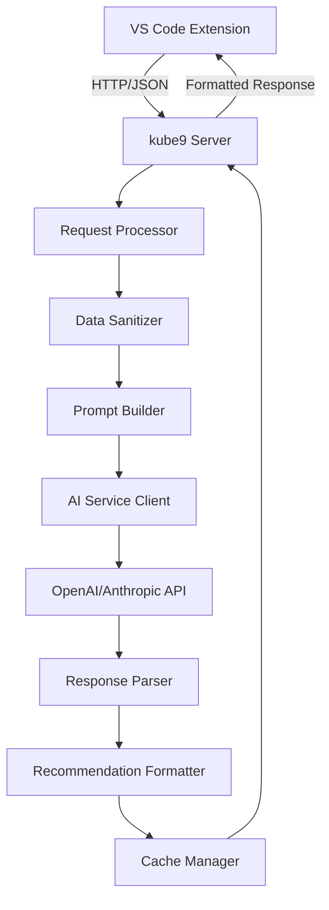
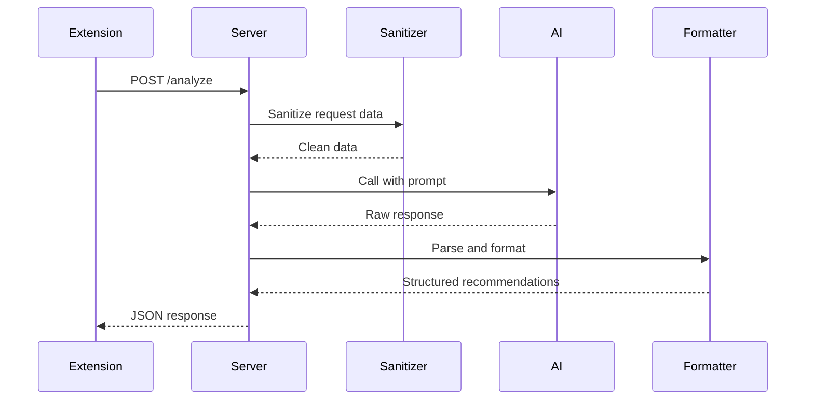

# AI Service Specification

## Overview

The AI service provides intelligent analysis and recommendations for Kubernetes resources by integrating with large language models (LLMs) and processing cluster context data.

## Architecture



## Component Responsibilities

### Request Processor
- **Purpose**: Handle incoming requests from VS Code extension
- **Responsibilities**:
  - Validate request format and authentication
  - Route requests to appropriate handlers
  - Manage request queuing and rate limiting
  - Handle errors and fallback responses

### Data Sanitizer
- **Purpose**: Remove sensitive information before AI processing
- **Responsibilities**:
  - Remove secrets, tokens, and credentials
  - Sanitize logs and event messages
  - Validate data structure and completeness
  - Maintain referential integrity for analysis

### Prompt Builder
- **Purpose**: Create effective prompts for different analysis types
- **Responsibilities**:
  - Select appropriate prompt templates based on resource type
  - Include relevant cluster context and configuration
  - Format data for optimal AI understanding
  - Optimize prompt length for cost and performance

### AI Service Client
- **Purpose**: Manage connections to external AI services
- **Responsibilities**:
  - Handle authentication with AI providers
  - Implement retry logic and error handling
  - Manage API rate limits and quotas
  - Support multiple AI providers (OpenAI, Anthropic, etc.)

## Data Flow



## Implementation Details

### API Endpoints

#### POST /analyze
Analyze a Kubernetes resource and provide recommendations.

**Request Body:**
```typescript
interface AnalysisRequest {
  resourceType: 'pod' | 'deployment' | 'service' | 'configmap' | 'secret';
  resourceData: KubernetesObject;
  clusterContext: ClusterContext;
  analysisType: 'performance' | 'security' | 'optimization' | 'best-practice';
  userPreferences?: UserPreferences;
}
```

**Response Body:**
```typescript
interface AnalysisResponse {
  recommendations: AIRecommendation[];
  confidence: number;
  reasoning: string;
  relatedResources: string[];
  suggestedActions: SuggestedAction[];
}
```

#### POST /validate-yaml
Validate YAML configuration against cluster state.

**Request Body:**
```typescript
interface YamlValidationRequest {
  yamlContent: string;
  clusterContext: ClusterContext;
  validationType: 'syntax' | 'best-practice' | 'cluster-fit';
}
```

### Prompt Engineering Strategy

#### Context-Aware Prompts
```typescript
const PROMPT_TEMPLATES = {
  pod: `Analyze this Kubernetes pod configuration:

POD YAML:
{yaml}

CLUSTER CONTEXT:
- Node resources: {nodeResources}
- Namespace quotas: {namespaceQuotas}
- Current usage patterns: {usagePatterns}

Please provide:
1. Performance analysis and optimization suggestions
2. Security recommendations
3. Resource allocation advice
4. Best practice compliance check

Format response as JSON with recommendation objects.`,

  deployment: `Analyze this deployment configuration:

DEPLOYMENT YAML:
{yaml}

CLUSTER CONTEXT:
- Current replica count: {currentReplicas}
- Traffic patterns: {trafficPatterns}
- Resource availability: {resourceAvailability}

Please provide recommendations for:
1. Scaling strategy optimization
2. Update strategy improvements
3. Resource management
4. Security hardening`,
};
```

#### Response Format Standardization
```typescript
interface AIRecommendation {
  id: string;
  type: 'warning' | 'info' | 'error' | 'success';
  category: 'performance' | 'security' | 'reliability' | 'cost' | 'best-practice';
  title: string;
  description: string;
  priority: 'low' | 'medium' | 'high' | 'critical';
  action: {
    type: 'yaml-change' | 'kubectl-command' | 'configuration' | 'manual';
    label: string;
    data: any;
    risk: 'low' | 'medium' | 'high';
  };
  reasoning: string;
  confidence: number;
  clusterImpact: string;
}
```

## Security Model

### Data Sanitization Rules
```typescript
const SANITIZATION_RULES = {
  secrets: /password|token|key|credential/i,
  personalData: /email|name|user/i,
  sensitiveLogs: /error|exception|stack/i,
  credentials: /auth|cert|kubeconfig/i
};
```

### Request Validation
- Validate resource type and structure
- Check authentication tokens
- Rate limiting per user/session
- Input size limits to prevent abuse

### Response Validation
- Validate AI response format
- Check for malicious content
- Ensure recommendations are actionable
- Verify confidence scores are reasonable

## Performance Optimizations

### Caching Strategy
```typescript
interface CacheEntry {
  key: string; // Hash of request parameters
  response: AIRecommendation[];
  timestamp: number;
  ttl: number; // Time to live
  accessCount: number;
}

class RecommendationCache {
  private cache = new Map<string, CacheEntry>();

  async getOrCompute(key: string, computeFn: () => Promise<AIRecommendation[]>): Promise<AIRecommendation[]> {
    const entry = this.cache.get(key);

    if (entry && !this.isExpired(entry)) {
      entry.accessCount++;
      return entry.response;
    }

    const response = await computeFn();
    this.cache.set(key, {
      key,
      response,
      timestamp: Date.now(),
      ttl: this.calculateTTL(key),
      accessCount: 1
    });

    return response;
  }
}
```

### Request Batching
- Group related requests for efficiency
- Implement request deduplication
- Use appropriate AI model sizes based on complexity

## Error Handling

### Graceful Degradation
- Provide basic recommendations when AI unavailable
- Show cached recommendations when possible
- Clear error messages for users

### Retry Logic
- Exponential backoff for AI service failures
- Circuit breaker pattern for persistent issues
- Fallback to simpler analysis methods

## Testing Strategy

### Unit Tests
- Prompt building logic
- Response parsing and validation
- Caching mechanisms
- Error handling paths

### Integration Tests
- Full request/response cycle
- AI service integration
- Data sanitization
- Performance under load

### E2E Tests
- Complete workflows from extension request to response
- Error scenarios and recovery
- Performance benchmarks

## Monitoring and Analytics

### Metrics Collection
- Request volume and success rates
- AI service response times
- Cache hit rates
- User engagement with recommendations

### Performance Monitoring
- Memory usage in server
- API call costs and optimization
- Response time SLAs
- Error rate tracking

## Future Enhancements

### Advanced AI Features
- Custom fine-tuned models for Kubernetes analysis
- Integration with monitoring systems (Prometheus, Grafana)
- Machine learning for pattern recognition
- Predictive analysis for resource planning

### Multi-Provider Support
- Automatic provider failover
- Cost optimization across providers
- Performance comparison and selection
- Custom model deployment options
