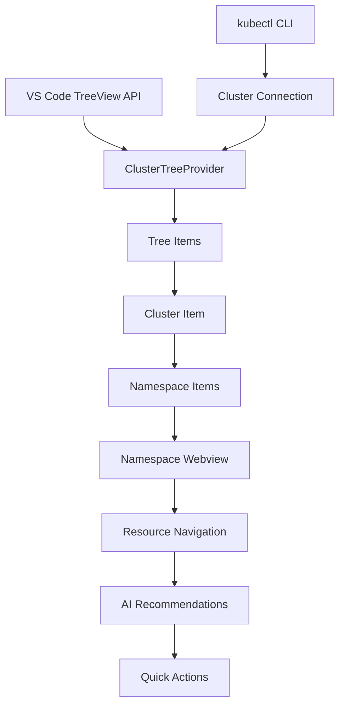
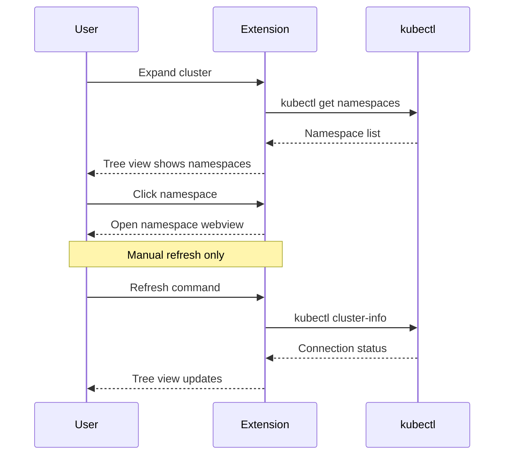

# Tree View Specification

## Overview

The tree view provides simplified navigation of Kubernetes clusters and namespaces. It displays a 2-level hierarchy: clusters at the top level, with namespaces listed underneath when expanded. Clicking on any namespace opens a webview for detailed resource navigation and management.

## Architecture



## Component Responsibilities

### ClusterTreeProvider
- **Purpose**: Main tree data provider implementing `vscode.TreeDataProvider`
- **Responsibilities**:
  - Parse kubeconfig files and extract cluster information
  - Use kubectl commands to verify cluster connectivity
  - Query namespaces using kubectl
  - Build simple 2-level tree structure (Clusters → Namespaces)
  - Manage tree item icons and status indicators
  - Open webviews when namespaces are clicked

### Tree Items Hierarchy
1. **Cluster Items**: Top-level nodes representing configured clusters
2. **Namespace Items**: Child nodes under each cluster
   - "All Namespaces" appears as the first option under each cluster
   - Individual namespaces follow alphabetically
   - Clicking any namespace opens a webview for navigation

## Data Flow



## Implementation Details

### Tree Item Structure
```typescript
interface TreeItemData {
  type: 'cluster' | 'namespace' | 'allNamespaces';
  name: string;
  status?: 'connected' | 'disconnected';
  metadata?: {
    context: string;
    cluster: string;
  };
}
```

### Namespace Listing
- Namespaces are queried using `kubectl get namespaces --output=json`
- "All Namespaces" is a special tree item that appears first
- Individual namespaces are sorted alphabetically
- Clicking any namespace item triggers a webview to open

### Status Indicators
- **Cluster Status**: Connected/disconnected indicators based on kubectl connectivity
- **Connection Method**: Uses `kubectl cluster-info` to verify cluster accessibility
- **No Automatic Retry**: If kubectl cannot connect, status shows disconnected and user must manually refresh

## User Experience

### Visual Design
- **Icons**: Use VS Code's built-in Kubernetes icons where available
- **Colors**: Status-based coloring (green=healthy, yellow=warning, red=error)
- **Badges**: Show resource counts and status summaries
- **Tooltips**: Display additional information on hover

### Interactions
- **Click cluster**: Expand to show namespaces
- **Click namespace**: Open webview panel for namespace navigation
- **Click "All Namespaces"**: Open webview showing cluster-wide resource view
- **Right-click**: Context menu with relevant actions (refresh, switch context)
- **Manual Refresh**: User-triggered refresh command updates tree

## Performance Considerations

### Efficient Loading
- **Lazy Loading**: Namespaces loaded only when cluster is expanded
- **Caching**: Cache namespace lists to avoid redundant kubectl calls
- **Simple Structure**: 2-level tree minimizes memory overhead

### Memory Management
- **Minimal Tree Data**: Only clusters and namespaces in tree
- **kubectl Process Management**: Spawn kubectl processes only when needed
- **No Background Polling**: No automatic periodic updates

## Error Handling

### Connection Issues
- **Failed kubectl Connection**: Show disconnected status immediately
- **No Automatic Retry**: Extension does not cycle retry attempts
- **Manual Refresh Only**: User must explicitly trigger refresh to reconnect
- **Clear Error Messages**: Display helpful error message when kubectl fails
- **Graceful Exit**: If kubectl unavailable, show appropriate message without crashing

### Namespace Access
- **Permission Errors**: Show error in tree if namespaces cannot be listed
- **kubectl Errors**: Display kubectl error messages to user
- **Fallback Display**: Show "Unable to list namespaces" if kubectl fails

## Testing Strategy

### Unit Tests
- Tree provider logic
- Namespace listing and sorting
- kubectl command construction
- Status calculation functions

### Integration Tests
- kubeconfig parsing
- kubectl command execution
- Namespace retrieval from clusters

### E2E Tests
- Tree navigation to namespaces
- Webview panel opening from namespace clicks
- Manual refresh behavior
- Connection failure handling
