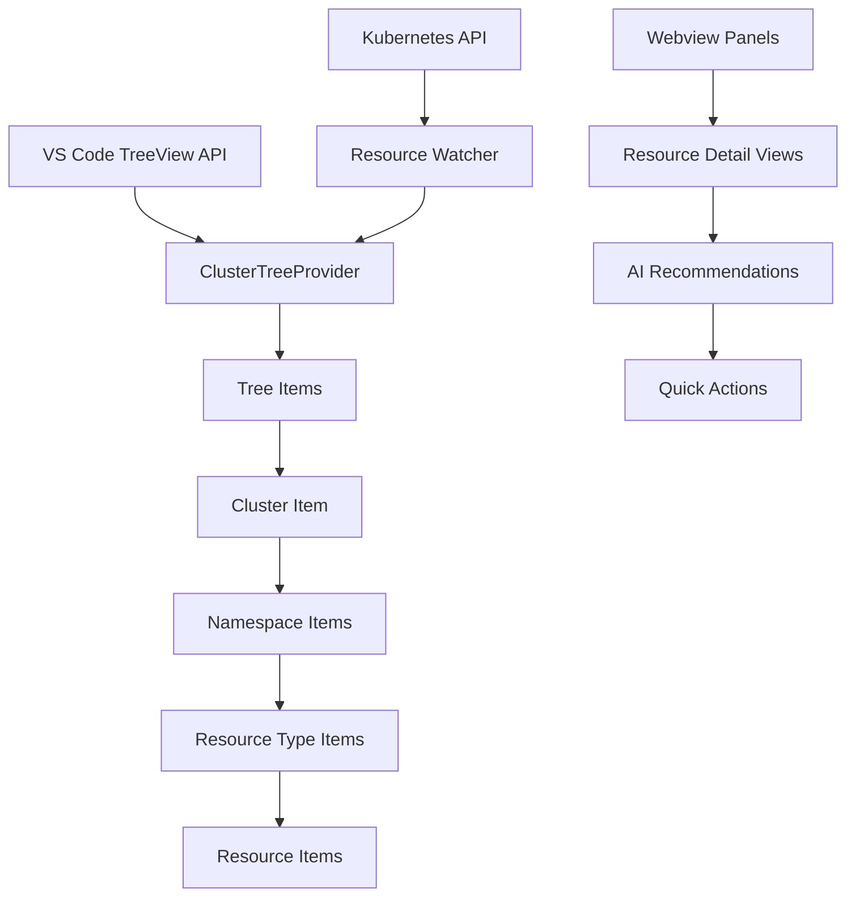
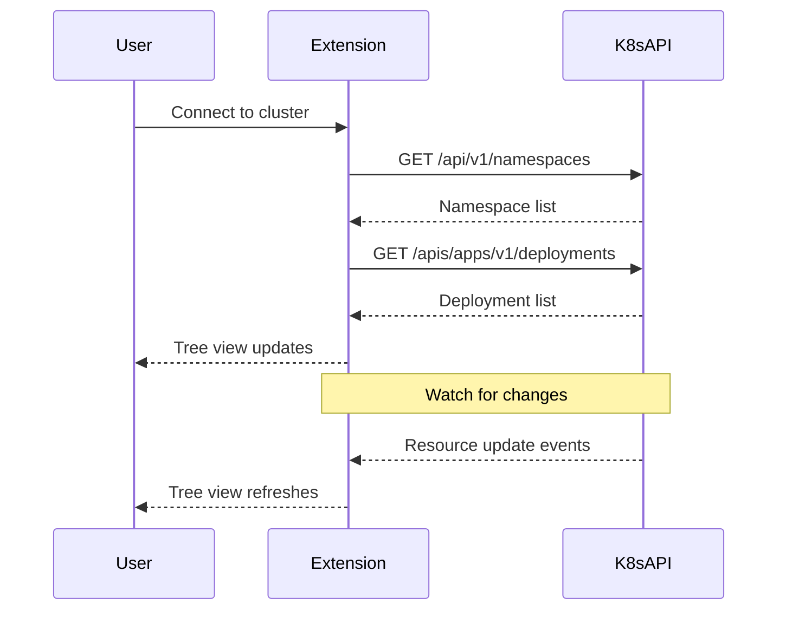

# Tree View Specification

## Overview

The tree view provides hierarchical navigation of Kubernetes clusters, following the familiar pattern established by the VS Code Kubernetes extension. It displays clusters, namespaces, and resources in a collapsible tree structure.

## Architecture



## Component Responsibilities

### ClusterTreeProvider
- **Purpose**: Main tree data provider implementing `vscode.TreeDataProvider`
- **Responsibilities**:
  - Parse kubeconfig files and extract cluster information
  - Query Kubernetes API for current cluster state
  - Build tree structure with appropriate grouping
  - Handle real-time updates via watch mechanisms
  - Manage tree item icons and status indicators

### Tree Items Hierarchy
1. **Cluster Items**: Top-level nodes representing configured clusters
2. **Namespace Items**: Child nodes under each cluster
3. **Resource Type Items**: Grouped by Kubernetes API groups (Workloads, Network, etc.)
4. **Resource Items**: Individual Kubernetes resources (pods, services, etc.)

## Data Flow



## Implementation Details

### Tree Item Structure
```typescript
interface TreeItemData {
  type: 'cluster' | 'namespace' | 'resourceType' | 'resource';
  name: string;
  status?: 'ready' | 'warning' | 'error';
  metadata?: KubernetesMetadata;
  children?: TreeItemData[];
}
```

### Resource Grouping Strategy
```typescript
const RESOURCE_GROUPS = {
  workloads: [
    'deployments', 'statefulsets', 'daemonsets',
    'jobs', 'cronjobs', 'pods', 'replicasets'
  ],
  network: [
    'services', 'ingresses', 'networkpolicies',
    'endpoints', 'endpointSlices'
  ],
  storage: [
    'persistentvolumes', 'persistentvolumeclaims',
    'storageclasses', 'volumeattachments'
  ],
  configuration: [
    'configmaps', 'secrets', 'serviceaccounts',
    'roles', 'rolebindings', 'clusterroles', 'clusterrolebindings'
  ]
};
```

### Status Indicators
- **Cluster Status**: Connected/disconnected indicators
- **Resource Status**: Ready/Pending/Failed based on conditions
- **Health Status**: Based on resource usage and events
- **AI Status**: Indicates if AI recommendations are available

## User Experience

### Visual Design
- **Icons**: Use VS Code's built-in Kubernetes icons where available
- **Colors**: Status-based coloring (green=healthy, yellow=warning, red=error)
- **Badges**: Show resource counts and status summaries
- **Tooltips**: Display additional information on hover

### Interactions
- **Click**: Select and open webview panel
- **Right-click**: Context menu with relevant actions
- **Double-click**: Expand/collapse tree nodes
- **Search**: Filter tree view by resource name or type

## Performance Considerations

### Efficient Loading
- **Lazy Loading**: Only load visible tree branches
- **Pagination**: For clusters with many resources
- **Caching**: Cache resource lists to avoid redundant API calls
- **Background Updates**: Update tree without blocking UI

### Memory Management
- **Resource Cleanup**: Dispose of tree items when no longer visible
- **Connection Pooling**: Reuse Kubernetes API connections
- **Event Handling**: Efficient watch event processing

## Error Handling

### Connection Issues
- **Offline Mode**: Show cached data with offline indicators
- **Reconnection**: Automatic reconnection with exponential backoff
- **Partial Data**: Show available data even if some resources fail to load

### Resource Access
- **Permission Errors**: Show access denied indicators
- **API Errors**: Display error states in tree view
- **Fallback Display**: Graceful degradation when features unavailable

## Testing Strategy

### Unit Tests
- Tree provider logic
- Resource grouping algorithms
- Status calculation functions

### Integration Tests
- kubeconfig parsing
- Kubernetes API communication
- Real-time update handling

### E2E Tests
- Complete tree navigation workflows
- Webview panel opening and updates
- AI recommendation integration
