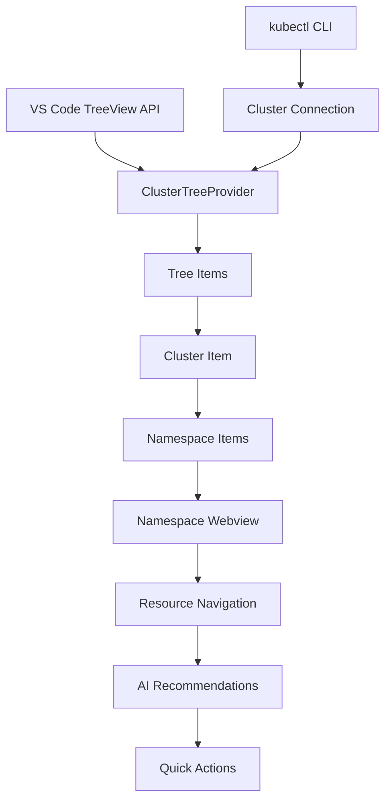
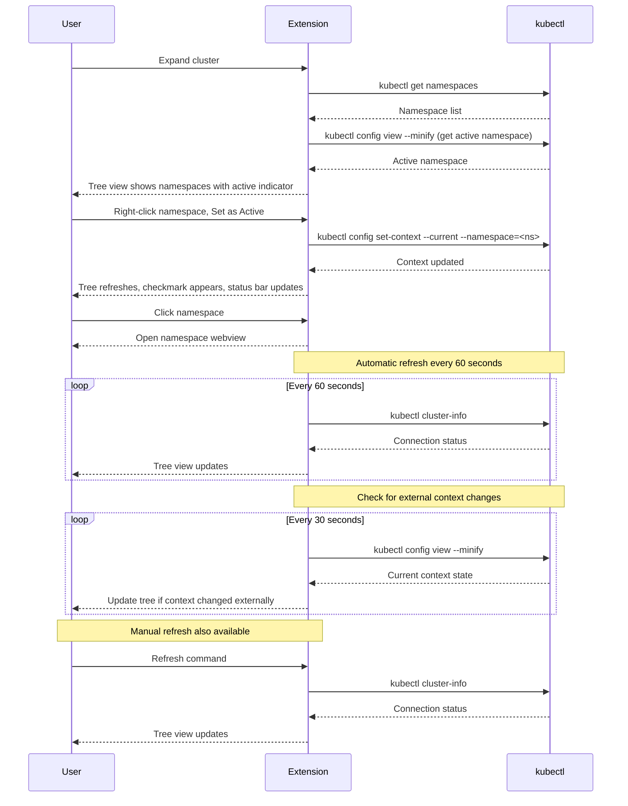

# Tree View Specification

## Overview

The tree view provides simplified navigation of Kubernetes clusters and namespaces. It displays a 2-level hierarchy: clusters at the top level, with namespaces listed underneath when expanded. Clicking on any namespace opens a webview for detailed resource navigation and management.

## Architecture



## Component Responsibilities

### ClusterTreeProvider
- **Purpose**: Main tree data provider implementing `vscode.TreeDataProvider`
- **Responsibilities**:
  - Parse kubeconfig files and extract cluster information
  - Use kubectl commands to verify cluster connectivity
  - Query namespaces using kubectl
  - Build simple 2-level tree structure (Clusters → Namespaces)
  - Manage tree item icons and status indicators
  - Open webviews when namespaces are clicked

### Tree Items Hierarchy
1. **Cluster Items**: Top-level nodes representing configured clusters
2. **Namespace Items**: Child nodes under each cluster
   - "All Namespaces" appears as the first option under each cluster
   - Individual namespaces follow alphabetically
   - Clicking any namespace opens a webview for navigation
   - Active namespace shows checkmark icon indicator
   - Right-click context menu provides namespace selection options

## Data Flow



## Implementation Details

### Tree Item Structure
```typescript
interface TreeItemData {
  type: 'cluster' | 'namespace' | 'allNamespaces';
  name: string;
  status?: 'connected' | 'disconnected';
  isActiveNamespace?: boolean; // True if this namespace is set in kubectl context
  metadata?: {
    context: string;
    cluster: string;
  };
}
```

### Namespace Listing
- Namespaces are queried using `kubectl get namespaces --output=json`
- "All Namespaces" is a special tree item that appears first
- Individual namespaces are sorted alphabetically
- Clicking any namespace item triggers a webview to open

### Namespace Selection via kubectl Context

#### Reading Active Namespace
- Extension reads current namespace from kubectl context on startup
- Command: `kubectl config view --minify --output=jsonpath='{..namespace}'`
- Empty result means no namespace is set (cluster-wide view)
- Cache result for 5 seconds to minimize kubectl calls
- Poll for external changes every 30 seconds

#### Setting Active Namespace
- User right-clicks namespace in tree view
- Selects "Set as Active Namespace" from context menu
- Extension executes: `kubectl config set-context --current --namespace=<namespace-name>`
- Tree view refreshes to show checkmark on active namespace
- Status bar updates to show: "Namespace: <namespace-name>"

#### Clearing Active Namespace
- User right-clicks active namespace or uses command palette
- Selects "Clear Active Namespace" from context menu
- Extension executes: `kubectl config set-context --current --namespace=''`
- Checkmark indicator removed from tree view
- Status bar updates to show: "Namespace: All"

#### Visual Indicators
- **Active Namespace**: Shows checkmark icon (✓) next to namespace name
- **Inactive Namespaces**: No special indicator
- **Status Bar**: Displays current namespace name or "All" if none set
- **Icon Theme**: Use VS Code's built-in "check" icon for active indicator

### Status Indicators
- **Cluster Status**: Connected/disconnected indicators based on kubectl connectivity
- **Connection Method**: Uses `kubectl cluster-info` to verify cluster accessibility
- **Automatic Refresh**: Connectivity checks run automatically every 60 seconds
- **Manual Refresh**: User can trigger immediate refresh via command
- **Status Persistence**: Cluster status is cached between refreshes to prevent spinner flicker
- **Warning Icons**: Disconnected clusters show a warning triangle icon (exclamation point in triangle)
- **Spinner Behavior**: Spinner only shows during initial connection check or when status is truly unknown

## User Experience

### Visual Design
- **Icons**: Use VS Code's built-in Kubernetes icons where available
- **Colors**: Status-based coloring (green=healthy, yellow=warning, red=error)
- **Badges**: Show resource counts and status summaries
- **Tooltips**: Display additional information on hover

### Interactions
- **Click cluster**: Expand to show namespaces
- **Click namespace**: Open webview panel for namespace navigation
- **Click "All Namespaces"**: Open webview showing cluster-wide resource view
- **Right-click namespace**: Context menu with namespace selection actions
- **Manual Refresh**: User-triggered refresh command updates tree

### Context Menu Actions

#### For Namespace Items (not active)
- **Set as Active Namespace**: Sets this namespace in kubectl context
- **Open in Webview**: Opens webview for this namespace
- **Refresh**: Refreshes this namespace's data

#### For Active Namespace Item
- **Clear Active Namespace**: Removes namespace from kubectl context
- **Open in Webview**: Opens webview for this namespace
- **Refresh**: Refreshes this namespace's data

#### Context Menu Registration
```typescript
// In package.json
"menus": {
  "view/item/context": [
    {
      "command": "kube9.setActiveNamespace",
      "when": "view == kube9TreeView && viewItem == namespace && !isActiveNamespace",
      "group": "namespace@1"
    },
    {
      "command": "kube9.clearActiveNamespace",
      "when": "view == kube9TreeView && viewItem == namespace && isActiveNamespace",
      "group": "namespace@1"
    }
  ]
}
```

## Performance Considerations

### Efficient Loading
- **Lazy Loading**: Namespaces loaded only when cluster is expanded
- **Caching**: Cache namespace lists to avoid redundant kubectl calls
- **Simple Structure**: 2-level tree minimizes memory overhead

### Memory Management
- **Minimal Tree Data**: Only clusters and namespaces in tree
- **kubectl Process Management**: Spawn kubectl processes only when needed
- **Periodic Connectivity Checks**: Automatic checks every 60 seconds with proper cleanup
- **Status Caching**: Cluster connectivity status cached in memory to reduce redundant checks
- **Context State Caching**: kubectl context state cached for 5 seconds to minimize config file reads
- **External Change Detection**: Poll kubectl context every 30 seconds for external changes

## Error Handling

### Connection Issues
- **Failed kubectl Connection**: Show disconnected status with warning icon immediately
- **Automatic Retry**: Extension checks connectivity every 60 seconds, whether pass or fail
- **Manual Refresh Available**: User can trigger immediate refresh via command without waiting
- **Clear Error Messages**: Display helpful error message when kubectl fails
- **Graceful Exit**: If kubectl unavailable, show appropriate message without crashing
- **Status Recovery**: Automatically updates icon when connection is restored on next check

### Namespace Access
- **Permission Errors**: Show error in tree if namespaces cannot be listed
- **kubectl Errors**: Display kubectl error messages to user
- **Fallback Display**: Show "Unable to list namespaces" if kubectl fails

### Namespace Context Errors
- **Context Read Failure**: Use cached state if kubectl config read fails, show warning
- **Context Write Failure**: Rollback UI state if kubectl config write fails, show error message
- **Invalid Namespace**: Warn user if selected namespace doesn't exist, suggest clearing selection
- **Permission Denied**: Show error if user lacks permission to modify kubeconfig
- **External Conflicts**: Detect and notify if context changed externally during operation

## Testing Strategy

### Unit Tests
- Tree provider logic
- Namespace listing and sorting
- kubectl command construction
- Status calculation functions
- Namespace context reading from kubectl config
- Namespace context setting and clearing
- Active namespace indicator logic
- Context state caching and invalidation

### Integration Tests
- kubeconfig parsing
- kubectl command execution
- Namespace retrieval from clusters
- kubectl context modification and verification
- Context state synchronization across operations

### E2E Tests
- Tree navigation to namespaces
- Webview panel opening from namespace clicks
- Manual refresh behavior
- Connection failure handling
- Setting active namespace from context menu
- Clearing active namespace selection
- Visual indicator updates when context changes
- External context change detection and UI update
- Status bar namespace display updates
