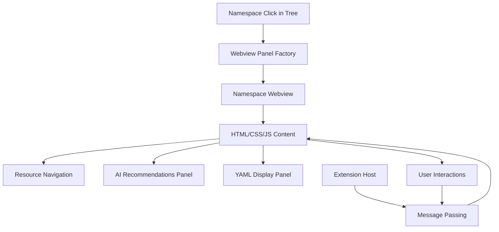
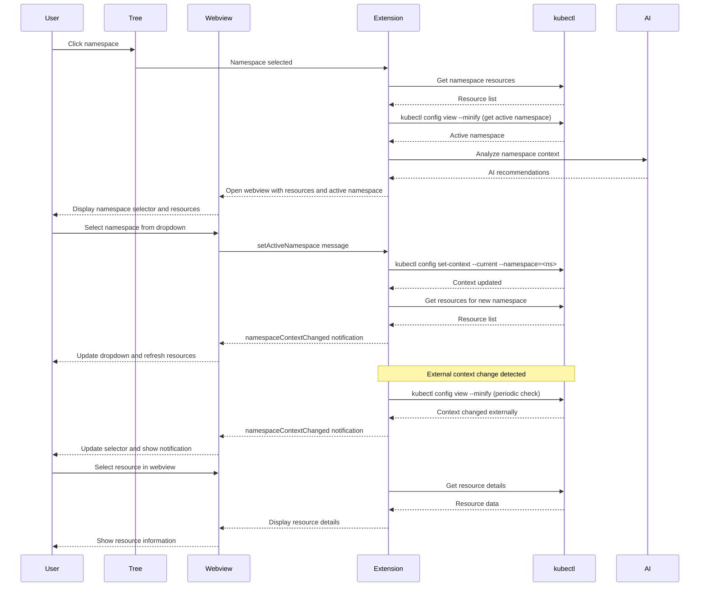

# Webview Panel Specification

## Overview

Webview panels provide detailed views for navigating and managing Kubernetes resources. Webviews are opened when a user clicks on a namespace (or "All Namespaces") in the tree view. The webview provides resource navigation, detailed information, YAML configuration, and AI-powered recommendations.

## Architecture



## Component Responsibilities

### WebviewPanelFactory
- **Purpose**: Creates webview panels for namespace navigation
- **Responsibilities**:
  - Create namespace-specific webview when namespace is clicked in tree
  - Create "All Namespaces" webview for cluster-wide navigation
  - Initialize webview with appropriate HTML/CSS/JS
  - Set up message passing between extension and webview
  - Handle webview lifecycle (create, update, dispose)

### Webview Types
- **Namespace Webview**: Displays resources within a single namespace with navigation, filtering, and AI recommendations
- **All Namespaces Webview**: Displays cluster-wide resource view with ability to browse across all namespaces
- **Resource Detail View**: Within the namespace webview, users can drill down into specific resources (pods, deployments, services, etc.)

## Data Flow



## Implementation Details

### Webview Content Structure
```typescript
interface WebviewContent {
  resource: KubernetesObject;
  metadata: ResourceMetadata;
  status: ResourceStatus;
  aiRecommendations: AIRecommendation[];
  quickActions: QuickAction[];
  yamlContent: string;
  relatedResources: RelatedResource[];
}
```

### Message Protocol
```typescript
// Extension to Webview
interface ExtensionMessage {
  command: 'updateResource' | 'updateRecommendations' | 'showYaml' | 'namespaceContextChanged';
  data: any;
}

// Webview to Extension
interface WebviewMessage {
  command: 'applyRecommendation' | 'editYaml' | 'refreshData' | 'setActiveNamespace' | 'clearActiveNamespace';
  data: any;
}

// Namespace context change notification
interface NamespaceContextChangedMessage extends ExtensionMessage {
  command: 'namespaceContextChanged';
  data: {
    namespace: string | null; // null means "All Namespaces"
    source: 'extension' | 'external'; // Where the change came from
  };
}
```

## UI Layout Specifications

### Common Layout Structure
```html
<div class="webview-container">
  <!-- Namespace Selection Header -->
  <div class="namespace-selector-bar">
    <label for="namespace-select">Active Namespace:</label>
    <select id="namespace-select" class="namespace-dropdown">
      <option value="">All Namespaces</option>
      <option value="default">default</option>
      <option value="production" selected>production</option>
      <option value="staging">staging</option>
    </select>
    <button id="clear-namespace" class="clear-btn" title="Clear namespace selection">
      Clear
    </button>
    <span class="namespace-info">
      (Changes kubectl context globally)
    </span>
  </div>

  <!-- Header Section -->
  <div class="resource-header">
    <h1>Pod: nginx-deployment-abc123</h1>
    <div class="status-badges">
      <span class="status running">Running</span>
      <span class="restart-count">Restarts: 0</span>
    </div>
  </div>

  <!-- Main Content Tabs -->
  <div class="tab-container">
    <div class="tab-nav">
      <button class="tab active">Overview</button>
      <button class="tab">YAML</button>
      <button class="tab">Events</button>
      <button class="tab">Logs</button>
    </div>

    <div class="tab-content">
      <!-- Overview Tab -->
      <div class="overview-panel">
        <!-- AI Recommendations -->
        <div class="ai-recommendations">
          <h3>AI Recommendations</h3>
          <!-- Recommendation cards -->
        </div>

        <!-- Resource Details -->
        <div class="resource-details">
          <!-- Resource-specific information -->
        </div>
      </div>

      <!-- YAML Tab -->
      <div class="yaml-panel">
        <pre><code class="yaml-content"></code></pre>
        <div class="yaml-actions">
          <button>Edit in VS Code</button>
          <button>Apply Changes</button>
        </div>
      </div>
    </div>
  </div>
</div>
```

### Namespace Selector Behavior

#### Selector State
- **Dropdown**: Populated with all namespaces from current cluster
- **Current Selection**: Shows namespace from kubectl context (or "All Namespaces" if none)
- **Clear Button**: Enabled only when a specific namespace is selected
- **Warning Label**: Shows "(Changes kubectl context globally)" to inform user

#### User Interactions
- **Select namespace from dropdown**: 
  - Sends `setActiveNamespace` message to extension with namespace name
  - Extension updates kubectl context
  - Extension sends `namespaceContextChanged` notification back
  - Webview refreshes resource data for selected namespace
  
- **Click Clear button**:
  - Sends `clearActiveNamespace` message to extension
  - Extension clears kubectl context namespace
  - Extension sends `namespaceContextChanged` notification
  - Webview refreshes to show all namespaces
  
- **Receive external context change**:
  - Extension sends `namespaceContextChanged` message
  - Webview updates dropdown selection to match
  - Webview refreshes resource data if needed
  - Show notification: "Namespace context changed externally to: <namespace>"

#### CSS Styling
```css
.namespace-selector-bar {
  display: flex;
  align-items: center;
  gap: 10px;
  padding: 10px;
  background-color: var(--vscode-editor-background);
  border-bottom: 1px solid var(--vscode-panel-border);
}

.namespace-dropdown {
  padding: 5px 10px;
  background-color: var(--vscode-dropdown-background);
  color: var(--vscode-dropdown-foreground);
  border: 1px solid var(--vscode-dropdown-border);
}

.clear-btn {
  padding: 5px 15px;
  background-color: var(--vscode-button-secondaryBackground);
  color: var(--vscode-button-secondaryForeground);
}

.namespace-info {
  font-size: 0.9em;
  color: var(--vscode-descriptionForeground);
  font-style: italic;
}
```

### Responsive Design
- **Mobile-friendly**: Support for different screen sizes
- **VS Code Integration**: Match VS Code's design language
- **Accessibility**: Proper ARIA labels and keyboard navigation
- **Performance**: Lazy loading of tab content

## AI Integration

### Recommendation Display
```typescript
interface AIRecommendation {
  id: string;
  type: 'optimization' | 'security' | 'performance' | 'best-practice';
  title: string;
  description: string;
  priority: 'low' | 'medium' | 'high';
  action: {
    label: string;
    type: 'yaml-change' | 'kubectl-command' | 'configuration';
    data: any;
  };
  reasoning: string;
  confidence: number;
}
```

### Contextual Recommendations
- **Based on Resource Type**: Different recommendations for pods vs deployments
- **Based on Cluster State**: Consider current resource usage and capacity
- **Based on Configuration**: Analyze YAML against best practices
- **Based on History**: Consider past issues and patterns

## Performance Considerations

### Efficient Rendering
- **Virtual Scrolling**: For large YAML content and log displays
- **Incremental Updates**: Update only changed sections
- **Lazy Loading**: Load detailed data only when needed
- **Caching**: Cache webview content and AI recommendations

### Memory Management
- **Webview Disposal**: Clean up webviews when no longer needed
- **Data Cleanup**: Remove sensitive data after use
- **Connection Management**: Proper cleanup of API connections

## User Experience

### Visual Design
- **Consistent Styling**: Match VS Code's design system
- **Clear Information Hierarchy**: Important info prominent, details accessible
- **Interactive Elements**: Hover effects, click handlers, tooltips
- **Status Indicators**: Clear visual feedback for all states

### Accessibility
- **Keyboard Navigation**: Full keyboard support
- **Screen Reader Support**: Proper ARIA labels and descriptions
- **High Contrast**: Support for accessibility modes
- **Font Scaling**: Responsive to user preferences

## Testing Strategy

### Unit Tests
- Webview panel creation and lifecycle
- Message passing between extension and webview
- UI component rendering and interactions

### Integration Tests
- Resource data loading and display
- AI recommendation integration
- YAML editing and validation
- Namespace selection from webview dropdown
- kubectl context updates from webview actions
- Message passing between webview and extension for namespace changes

### E2E Tests
- Complete workflows from tree selection to webview interaction
- AI recommendation application and validation
- Cross-resource navigation and context switching
- Namespace selection from webview with context update
- Clearing namespace selection from webview
- External namespace context change detection and webview update
- Namespace selector state synchronization across multiple webviews

## Security Considerations

### Data Sanitization
- Remove sensitive data before displaying in webview
- Validate all user inputs and AI recommendations
- Implement proper escaping for HTML content

### Access Control
- Respect Kubernetes RBAC permissions
- Show appropriate error messages for access denied
- Don't expose cluster credentials in webview

## Future Enhancements

### Advanced Features
- **Real-time Updates**: Live data streaming to webview
- **Interactive Editing**: Edit resources directly in webview
- **Multi-resource Views**: Compare multiple resources
- **Custom Dashboards**: User-configurable views
