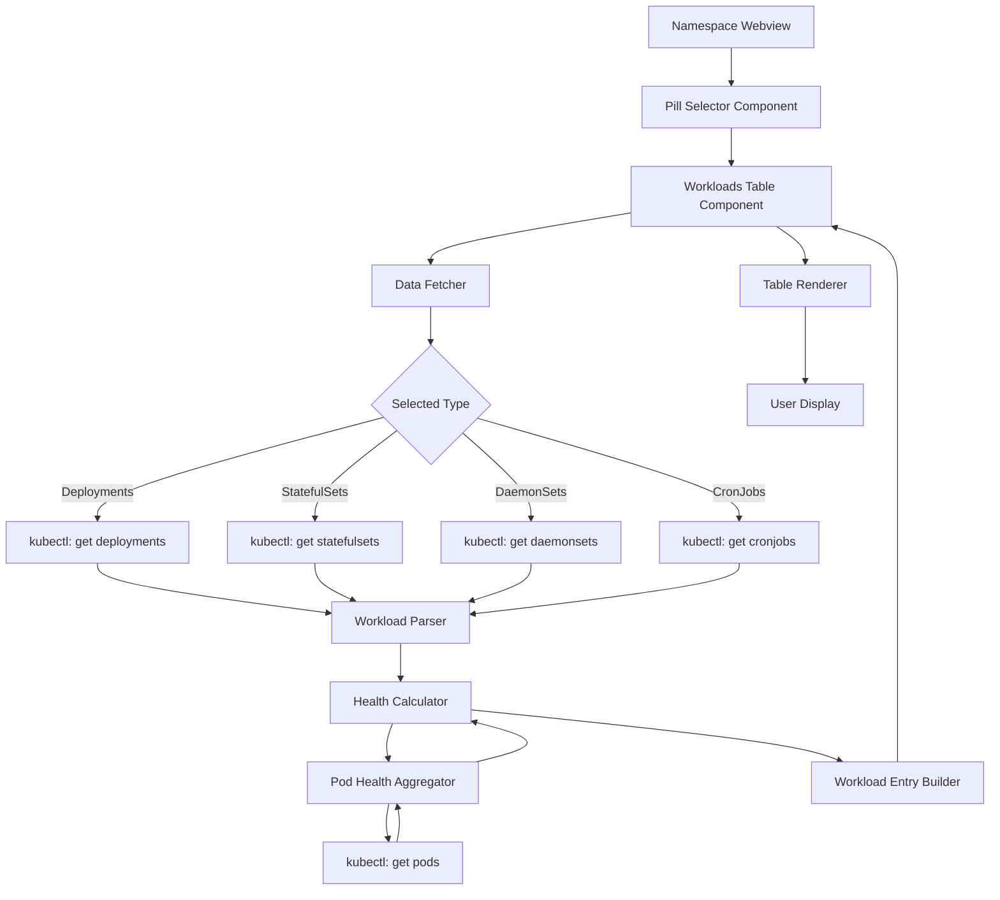
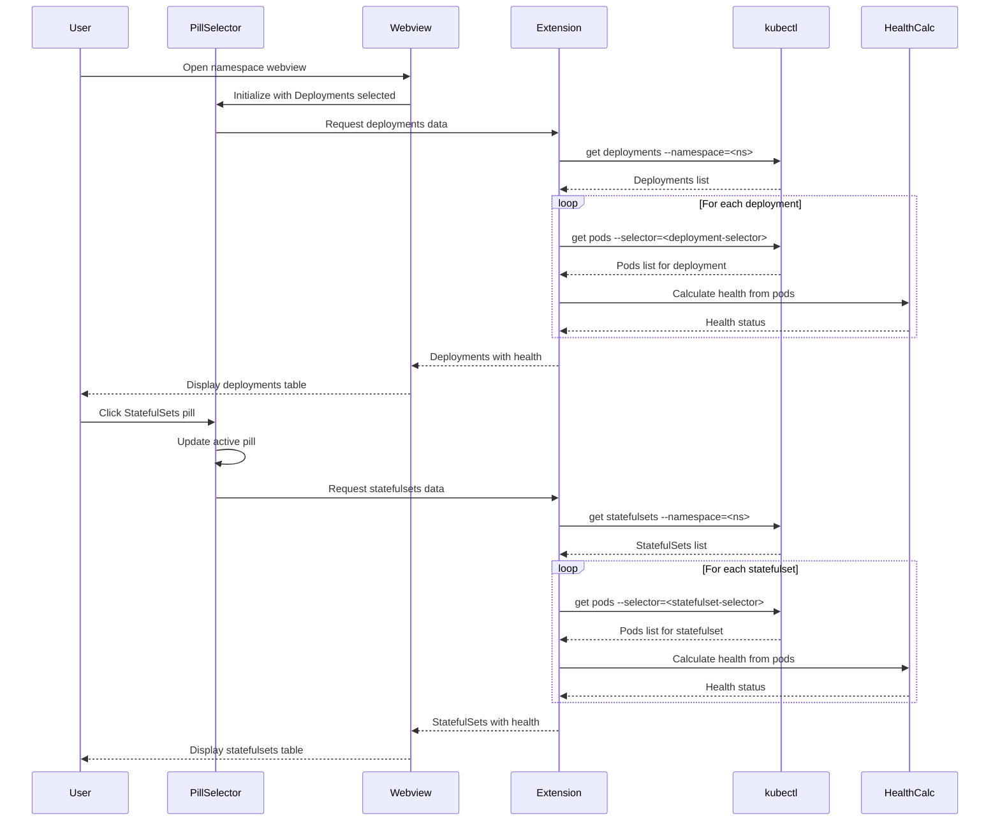

# Namespace Workloads Section Specification

## Overview

The namespace workloads section displays workload resources (Deployments, StatefulSets, DaemonSets, and CronJobs) running within a Kubernetes namespace. Users switch between workload types using horizontal pill selectors, and the table displays only the selected workload type. The table provides real-time health status derived from pod-level health checks and displays ready/desired replica counts for each workload.

## Architecture



## Data Flow



## Data Structures

### TypeScript Interfaces

```typescript
/**
 * Represents a single workload entry in the table
 */
interface WorkloadEntry {
  name: string;
  namespace: string;
  health: WorkloadHealth;
  readyReplicas: number;
  desiredReplicas: number;
  selector: string; // Label selector for finding pods
  creationTimestamp: string;
}

/**
 * The four supported workload types (used by pill selector)
 */
type WorkloadType = 'Deployment' | 'StatefulSet' | 'DaemonSet' | 'CronJob';

/**
 * Pill selector state
 */
interface PillSelectorState {
  selectedType: WorkloadType;
  availableTypes: WorkloadType[];
}

/**
 * Health status with supporting pod information
 */
interface WorkloadHealth {
  status: HealthStatus;
  podStatus: PodHealthSummary;
  lastChecked: Date;
}

/**
 * Health status enumeration
 */
type HealthStatus = 'Healthy' | 'Degraded' | 'Unhealthy' | 'Unknown';

/**
 * Aggregated pod health information
 */
interface PodHealthSummary {
  totalPods: number;
  readyPods: number;
  healthChecks: HealthCheckStats;
  conditions: PodConditionSummary[];
}

/**
 * Health check statistics from all pods
 */
interface HealthCheckStats {
  passed: number;   // Number of successful health checks
  failed: number;   // Number of failed health checks
  unknown: number;  // Number of health checks in unknown state
}

/**
 * Summary of pod conditions
 */
interface PodConditionSummary {
  type: string;       // e.g., 'Ready', 'Initialized', 'ContainersReady'
  status: 'True' | 'False' | 'Unknown';
  count: number;      // Number of pods with this condition
}

/**
 * Complete workloads table data
 */
interface WorkloadsTableData {
  workloads: WorkloadEntry[];
  lastUpdated: Date;
  namespace: string | null; // null means "All Namespaces"
  workloadType: WorkloadType; // Currently selected workload type
  error?: string;
}
```

## kubectl Commands

### Fetching Workload Resources

#### Deployments
```bash
kubectl get deployments \
  --namespace=<namespace> \
  --output=json \
  --kubeconfig=<path> \
  --context=<context>
```

If namespace context is set to "All Namespaces":
```bash
kubectl get deployments \
  --all-namespaces \
  --output=json \
  --kubeconfig=<path> \
  --context=<context>
```

#### StatefulSets
```bash
kubectl get statefulsets \
  --namespace=<namespace> \
  --output=json \
  --kubeconfig=<path> \
  --context=<context>
```

#### DaemonSets
```bash
kubectl get daemonsets \
  --namespace=<namespace> \
  --output=json \
  --kubeconfig=<path> \
  --context=<context>
```

#### CronJobs
```bash
kubectl get cronjobs \
  --namespace=<namespace> \
  --output=json \
  --kubeconfig=<path> \
  --context=<context>
```

### Fetching Pod Health Information

For each workload, fetch its pods using label selectors:

```bash
kubectl get pods \
  --namespace=<namespace> \
  --selector=<label-selector> \
  --output=json \
  --kubeconfig=<path> \
  --context=<context>
```

Example selector from deployment: `app=nginx,version=v1`

## Health Calculation Algorithm

### Step 1: Extract Pod Information

For each workload, extract pods using the workload's label selector:

```typescript
function getPodsForWorkload(
  workload: WorkloadEntry,
  namespace: string
): Promise<Pod[]> {
  const selector = workload.selector;
  return kubectl.getPods(namespace, selector);
}
```

### Step 2: Analyze Pod Health Checks

For each pod, analyze its conditions and container statuses:

```typescript
function analyzePodHealth(pod: Pod): PodHealthResult {
  const conditions = pod.status?.conditions || [];
  const containerStatuses = pod.status?.containerStatuses || [];
  
  // Check readiness condition
  const readyCondition = conditions.find(c => c.type === 'Ready');
  const isReady = readyCondition?.status === 'True';
  
  // Check container readiness and liveness probes
  const healthChecks = {
    passed: 0,
    failed: 0,
    unknown: 0
  };
  
  containerStatuses.forEach(container => {
    // Check if container is ready
    if (container.ready) {
      healthChecks.passed++;
    } else if (container.state?.waiting || container.state?.terminated) {
      healthChecks.failed++;
    } else {
      healthChecks.unknown++;
    }
  });
  
  return {
    isReady,
    healthChecks,
    conditions: conditions.map(c => ({
      type: c.type,
      status: c.status,
      reason: c.reason
    }))
  };
}
```

### Step 3: Aggregate Pod Health

Aggregate health across all pods in the workload:

```typescript
function aggregatePodHealth(pods: Pod[]): PodHealthSummary {
  const totalPods = pods.length;
  let readyPods = 0;
  const healthChecks = { passed: 0, failed: 0, unknown: 0 };
  const conditionMap = new Map<string, number>();
  
  pods.forEach(pod => {
    const podHealth = analyzePodHealth(pod);
    
    if (podHealth.isReady) {
      readyPods++;
    }
    
    healthChecks.passed += podHealth.healthChecks.passed;
    healthChecks.failed += podHealth.healthChecks.failed;
    healthChecks.unknown += podHealth.healthChecks.unknown;
    
    podHealth.conditions.forEach(condition => {
      const key = `${condition.type}:${condition.status}`;
      conditionMap.set(key, (conditionMap.get(key) || 0) + 1);
    });
  });
  
  const conditions: PodConditionSummary[] = [];
  conditionMap.forEach((count, key) => {
    const [type, status] = key.split(':');
    conditions.push({ 
      type, 
      status: status as 'True' | 'False' | 'Unknown', 
      count 
    });
  });
  
  return {
    totalPods,
    readyPods,
    healthChecks,
    conditions
  };
}
```

### Step 4: Calculate Overall Health Status

Determine the overall health status based on aggregated data:

```typescript
function calculateHealthStatus(
  readyReplicas: number,
  desiredReplicas: number,
  podSummary: PodHealthSummary
): HealthStatus {
  // Case 1: All replicas ready and all health checks passing
  if (readyReplicas === desiredReplicas && 
      podSummary.healthChecks.failed === 0 &&
      desiredReplicas > 0) {
    return 'Healthy';
  }
  
  // Case 2: No replicas ready or all health checks failing
  if (readyReplicas === 0 || 
      (podSummary.healthChecks.passed === 0 && 
       podSummary.healthChecks.failed > 0)) {
    return 'Unhealthy';
  }
  
  // Case 3: Some replicas ready or some health checks failing
  if ((readyReplicas < desiredReplicas && readyReplicas > 0) ||
      (podSummary.healthChecks.failed > 0 && 
       podSummary.healthChecks.passed > 0)) {
    return 'Degraded';
  }
  
  // Case 4: Unable to determine (no data or unknown states)
  if (podSummary.healthChecks.unknown > 0 && 
      podSummary.healthChecks.passed === 0 && 
      podSummary.healthChecks.failed === 0) {
    return 'Unknown';
  }
  
  // Default: If desiredReplicas is 0 (scaled down), show Unknown
  if (desiredReplicas === 0) {
    return 'Unknown';
  }
  
  // Fallback
  return 'Unknown';
}
```

## Section Layout Specifications

### HTML Structure

```html
<div class="workloads-section">
  <h2>Workloads</h2>
  
  <!-- Pill Selectors -->
  <div class="workload-type-pills">
    <button 
      class="pill-selector active" 
      data-workload-type="deployments"
      onclick="selectWorkloadType('Deployment')">
      Deployments
    </button>
    <button 
      class="pill-selector" 
      data-workload-type="statefulsets"
      onclick="selectWorkloadType('StatefulSet')">
      StatefulSets
    </button>
    <button 
      class="pill-selector" 
      data-workload-type="daemonsets"
      onclick="selectWorkloadType('DaemonSet')">
      DaemonSets
    </button>
    <button 
      class="pill-selector" 
      data-workload-type="cronjobs"
      onclick="selectWorkloadType('CronJob')">
      CronJobs
    </button>
  </div>
  
  <!-- Table Container -->
  <div class="table-container">
    <table class="workloads-table">
      <thead>
        <tr>
          <th class="col-name">Name</th>
          <th class="col-namespace">Namespace</th>
          <th class="col-health">Health</th>
          <th class="col-replicas">Ready/Desired</th>
        </tr>
      </thead>
      <tbody id="workloads-tbody">
        <!-- Workload rows are dynamically generated based on selected pill -->
        <tr class="workload-row">
          <td class="workload-name">nginx-deployment</td>
          <td class="workload-namespace">production</td>
          <td class="workload-health">
            <div class="health-status">
              <span class="health-indicator healthy" title="Healthy">●</span>
              <span class="health-text">Healthy</span>
            </div>
          </td>
          <td class="workload-replicas">
            <span class="replicas-count">3/3</span>
          </td>
        </tr>
        <!-- More rows... -->
      </tbody>
    </table>
  </div>
  
  <!-- Empty State -->
  <div class="empty-state" style="display: none;">
    <div class="empty-icon">📦</div>
    <p class="empty-message" id="empty-message">No deployments found in this namespace</p>
  </div>
  
  <!-- Info Note -->
  <p class="table-note">
    Workload items are currently non-interactive.
  </p>
</div>
```

### CSS Styling

Complete styling is provided in the main webview-spec.spec.md file. Key styles include:

- Pill selector layout and states (active/inactive)
- Pill hover effects and transitions
- Table responsive layout
- Health indicator colors (green, yellow, red, gray)
- Row hover effects (without pointer cursor)
- Empty state styling
- Accessibility features (high contrast, focus indicators)

## Implementation Details

### Data Fetching Strategy

1. **On-Demand Fetching**: Fetch only the selected workload type when pill is clicked
2. **Pod Health Lazy Loading**: For each workload, fetch pod health data in batches
3. **Caching**: Cache workload data for 30 seconds per type to reduce kubectl calls
4. **Error Handling**: Show error messages if queries fail

```typescript
async function fetchWorkloadsByType(
  namespace: string,
  workloadType: WorkloadType
): Promise<WorkloadsTableData> {
  try {
    // Fetch only the selected workload type
    let workloads: WorkloadEntry[] = [];
    
    switch (workloadType) {
      case 'Deployment':
        workloads = await fetchDeployments(namespace);
        break;
      case 'StatefulSet':
        workloads = await fetchStatefulSets(namespace);
        break;
      case 'DaemonSet':
        workloads = await fetchDaemonSets(namespace);
        break;
      case 'CronJob':
        workloads = await fetchCronJobs(namespace);
        break;
    }
    
    // Fetch pod health for each workload
    const workloadsWithHealth = await Promise.all(
      workloads.map(async (workload) => {
        const pods = await getPodsForWorkload(workload, namespace);
        const podSummary = aggregatePodHealth(pods);
        const health = calculateHealthStatus(
          workload.readyReplicas,
          workload.desiredReplicas,
          podSummary
        );
        
        return {
          ...workload,
          health: {
            status: health,
            podStatus: podSummary,
            lastChecked: new Date()
          }
        };
      })
    );
    
    // Sort by name
    workloadsWithHealth.sort((a, b) => a.name.localeCompare(b.name));
    
    return {
      workloads: workloadsWithHealth,
      lastUpdated: new Date(),
      namespace,
      workloadType
    };
  } catch (error) {
    return {
      workloads: [],
      lastUpdated: new Date(),
      namespace,
      workloadType,
      error: error.message
    };
  }
}

// Pill selector click handler
function selectWorkloadType(type: WorkloadType): void {
  // Update pill visual state
  updatePillSelection(type);
  
  // Fetch workloads for selected type
  const data = await fetchWorkloadsByType(currentNamespace, type);
  
  // Update table with new data
  renderWorkloadsTable(data);
}
```

### Non-Interactive Behavior

Workload table rows are currently non-interactive:

1. **No Click Actions**: Clicking on rows does nothing
2. **Cursor Style**: Use `cursor: default` instead of `cursor: pointer`
3. **Hover Effects**: Show subtle hover background for visual feedback
4. **Informational Note**: Display note about non-interactive state
5. **Data Attributes**: Structure HTML with data attributes for semantic clarity

```typescript
// Example row structure with data attributes
function renderWorkloadRow(workload: WorkloadEntry): HTMLElement {
  const row = document.createElement('tr');
  row.className = 'workload-row';
  row.dataset.workloadName = workload.name;
  row.dataset.workloadType = workload.type;
  // Row renders but has no click handler
  return row;
}
```

## Performance Considerations

### Optimization Strategies

1. **Batch Queries**: Fetch all workloads of the same type in one kubectl call
2. **Incremental Health Checks**: Check pod health in batches of 10
3. **Debounced Updates**: Debounce refresh requests to max 1 per 5 seconds
4. **Virtual Scrolling**: For namespaces with 100+ workloads, implement virtual scrolling
5. **Memoization**: Cache health calculations for identical pod states

### Resource Limits

- Maximum workloads displayed: Unlimited (use virtual scrolling if needed)
- Maximum pods per health check: 1000
- Query timeout: 30 seconds per workload type
- Refresh interval: User-initiated or webhook-driven

## Testing Requirements

### Unit Tests

1. Health calculation algorithm with various pod states
2. Data parsing from kubectl JSON responses
3. Sorting and filtering logic
4. Empty state detection

### Integration Tests

1. Fetching workloads across all 4 types
2. Pod health aggregation for real clusters
3. Error handling when kubectl fails
4. Namespace filtering behavior

### E2E Tests

1. Table renders with correct data
2. Health indicators display correct colors
3. Ready/Desired counts are accurate
4. Non-clickable behavior verified
5. Empty state shows when appropriate
6. Refresh updates data correctly

## Accessibility

### ARIA Labels

```html
<table class="workloads-table" role="table" aria-label="Namespace Workloads">
  <thead>
    <tr role="row">
      <th role="columnheader" aria-sort="ascending">Name</th>
      <!-- ... -->
    </tr>
  </thead>
  <tbody>
    <tr role="row" aria-label="Deployment: nginx-deployment, Status: Healthy">
      <!-- ... -->
    </tr>
  </tbody>
</table>
```

### Keyboard Navigation

- Tab navigation through table elements
- Screen reader announces health status
- High contrast mode support for health indicators

## Future Enhancements

1. **Clickable Workloads**: Once resource profiles are built, enable navigation to detail views
2. **Sorting**: Allow sorting by any column
3. **Filtering**: Filter by workload type or health status
4. **Real-time Updates**: WebSocket-based live health updates
5. **Metrics Integration**: Show CPU/Memory usage alongside health
6. **Export**: Export table data as CSV or JSON

