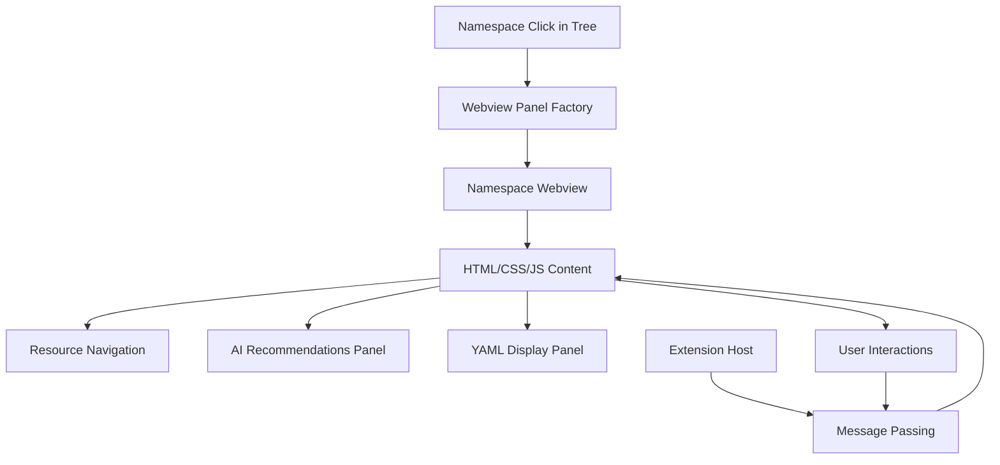
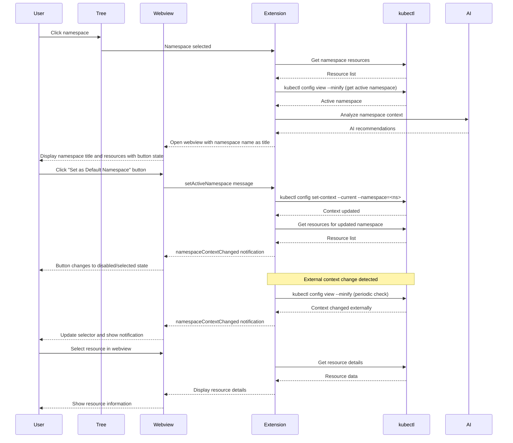

# Webview Panel Specification

## Overview

Webview panels provide detailed views for navigating and managing Kubernetes resources. Webviews are opened when a user clicks on a namespace (or "All Namespaces") in the tree view. The webview provides resource navigation, detailed information, YAML configuration, and AI-powered recommendations.

## Architecture



## Component Responsibilities

### WebviewPanelFactory
- **Purpose**: Creates webview panels for namespace navigation
- **Responsibilities**:
  - Create namespace-specific webview when namespace is clicked in tree
  - Create "All Namespaces" webview for cluster-wide navigation
  - Initialize webview with appropriate HTML/CSS/JS
  - Set up message passing between extension and webview
  - Handle webview lifecycle (create, update, dispose)

### Webview Types
- **Namespace Webview**: Displays resources within a single namespace with navigation, filtering, and AI recommendations
- **All Namespaces Webview**: Displays cluster-wide resource view with ability to browse across all namespaces
- **Resource Detail View**: Within the namespace webview, users can drill down into specific resources (pods, deployments, services, etc.)

## Data Flow



## Implementation Details

### Webview Content Structure
```typescript
interface WebviewContent {
  resource: KubernetesObject;
  metadata: ResourceMetadata;
  status: ResourceStatus;
  aiRecommendations: AIRecommendation[];
  quickActions: QuickAction[];
  yamlContent: string;
  relatedResources: RelatedResource[];
}
```

### Message Protocol
```typescript
// Extension to Webview
interface ExtensionMessage {
  command: 'updateResource' | 'updateRecommendations' | 'showYaml' | 'namespaceContextChanged';
  data: any;
}

// Webview to Extension
interface WebviewMessage {
  command: 'applyRecommendation' | 'editYaml' | 'refreshData' | 'setActiveNamespace';
  data: any;
}

// Namespace context change notification
interface NamespaceContextChangedMessage extends ExtensionMessage {
  command: 'namespaceContextChanged';
  data: {
    namespace: string | null; // null means "All Namespaces"
    source: 'extension' | 'external'; // Where the change came from
    isActive: boolean; // Whether the webview's namespace is now the active one
  };
}
```

## UI Layout Specifications

### Common Layout Structure
```html
<div class="webview-container">
  <!-- Header Section with Namespace Title -->
  <div class="namespace-header">
    <h1 class="namespace-title">production</h1>
    <button id="set-default-namespace" class="default-namespace-btn" disabled>
      <span class="btn-icon">✓</span>
      <span class="btn-text">Default Namespace</span>
    </button>
    <span class="namespace-info">
      (Changes kubectl context globally)
    </span>
  </div>

  <!-- Resource Navigation Section -->
  <div class="resource-header">
    <h2>Pod: nginx-deployment-abc123</h2>
    <div class="status-badges">
      <span class="status running">Running</span>
      <span class="restart-count">Restarts: 0</span>
    </div>
  </div>

  <!-- Main Content Tabs -->
  <div class="tab-container">
    <div class="tab-nav">
      <button class="tab active">Overview</button>
      <button class="tab">YAML</button>
      <button class="tab">Events</button>
      <button class="tab">Logs</button>
    </div>

    <div class="tab-content">
      <!-- Overview Tab -->
      <div class="overview-panel">
        <!-- AI Recommendations -->
        <div class="ai-recommendations">
          <h3>AI Recommendations</h3>
          <!-- Recommendation cards -->
        </div>

        <!-- Resource Details -->
        <div class="resource-details">
          <!-- Resource-specific information -->
        </div>
      </div>

      <!-- YAML Tab -->
      <div class="yaml-panel">
        <pre><code class="yaml-content"></code></pre>
        <div class="yaml-actions">
          <button>Edit in VS Code</button>
          <button>Apply Changes</button>
        </div>
      </div>
    </div>
  </div>
</div>
```

### Namespace Button Behavior

#### Button State
- **Namespace Title**: Displays the namespace name as the webview title (h1)
- **Button Label**: "Set as Default Namespace" (when enabled) or "Default Namespace" (when disabled)
- **Enabled State**: Button is clickable when viewing a namespace that is NOT the current kubectl context namespace
- **Disabled/Selected State**: Button is disabled with checkmark icon when viewing the namespace that IS the current kubectl context namespace
- **Warning Label**: Shows "(Changes kubectl context globally)" to inform user

#### User Interactions
- **Click "Set as Default Namespace" button** (when enabled): 
  - Sends `setActiveNamespace` message to extension with namespace name
  - Extension updates kubectl context
  - Extension sends `namespaceContextChanged` notification back
  - Button changes to disabled/selected state with checkmark
  - Tree view updates to show checkmark on this namespace
  
- **Receive external context change**:
  - Extension sends `namespaceContextChanged` message with isActive flag
  - Webview updates button state based on isActive flag
  - If this namespace is now active externally, button becomes disabled/selected
  - If this namespace is no longer active, button becomes enabled
  - Show notification: "Namespace context changed externally to: <namespace>"

#### CSS Styling
```css
.namespace-header {
  display: flex;
  align-items: center;
  gap: 15px;
  padding: 15px;
  background-color: var(--vscode-editor-background);
  border-bottom: 2px solid var(--vscode-panel-border);
}

.namespace-title {
  flex: 1;
  margin: 0;
  font-size: 1.5em;
  font-weight: 600;
  color: var(--vscode-foreground);
}

.default-namespace-btn {
  display: flex;
  align-items: center;
  gap: 8px;
  padding: 8px 16px;
  background-color: var(--vscode-button-background);
  color: var(--vscode-button-foreground);
  border: none;
  border-radius: 4px;
  cursor: pointer;
  font-size: 0.95em;
}

.default-namespace-btn:hover:not(:disabled) {
  background-color: var(--vscode-button-hoverBackground);
}

.default-namespace-btn:disabled {
  background-color: var(--vscode-button-secondaryBackground);
  color: var(--vscode-button-secondaryForeground);
  cursor: default;
  opacity: 0.8;
}

.default-namespace-btn .btn-icon {
  font-size: 1.1em;
}

.default-namespace-btn:not(:disabled) .btn-icon {
  display: none;
}

.namespace-info {
  font-size: 0.85em;
  color: var(--vscode-descriptionForeground);
  font-style: italic;
}
```

### Responsive Design
- **Mobile-friendly**: Support for different screen sizes
- **VS Code Integration**: Match VS Code's design language
- **Accessibility**: Proper ARIA labels and keyboard navigation
- **Performance**: Lazy loading of tab content

## AI Integration

### Recommendation Display
```typescript
interface AIRecommendation {
  id: string;
  type: 'optimization' | 'security' | 'performance' | 'best-practice';
  title: string;
  description: string;
  priority: 'low' | 'medium' | 'high';
  action: {
    label: string;
    type: 'yaml-change' | 'kubectl-command' | 'configuration';
    data: any;
  };
  reasoning: string;
  confidence: number;
}
```

### Contextual Recommendations
- **Based on Resource Type**: Different recommendations for pods vs deployments
- **Based on Cluster State**: Consider current resource usage and capacity
- **Based on Configuration**: Analyze YAML against best practices
- **Based on History**: Consider past issues and patterns

## Performance Considerations

### Efficient Rendering
- **Virtual Scrolling**: For large YAML content and log displays
- **Incremental Updates**: Update only changed sections
- **Lazy Loading**: Load detailed data only when needed
- **Caching**: Cache webview content and AI recommendations

### Memory Management
- **Webview Disposal**: Clean up webviews when no longer needed
- **Data Cleanup**: Remove sensitive data after use
- **Connection Management**: Proper cleanup of API connections

## User Experience

### Visual Design
- **Consistent Styling**: Match VS Code's design system
- **Clear Information Hierarchy**: Important info prominent, details accessible
- **Interactive Elements**: Hover effects, click handlers, tooltips
- **Status Indicators**: Clear visual feedback for all states

### Accessibility
- **Keyboard Navigation**: Full keyboard support
- **Screen Reader Support**: Proper ARIA labels and descriptions
- **High Contrast**: Support for accessibility modes
- **Font Scaling**: Responsive to user preferences

## Testing Strategy

### Unit Tests
- Webview panel creation and lifecycle
- Message passing between extension and webview
- UI component rendering and interactions

### Integration Tests
- Resource data loading and display
- AI recommendation integration
- YAML editing and validation
- Namespace button state based on kubectl context
- kubectl context updates from webview button clicks
- Message passing between webview and extension for namespace changes
- Button state transitions (enabled ↔ disabled/selected)

### E2E Tests
- Complete workflows from tree selection to webview interaction
- AI recommendation application and validation
- Cross-resource navigation and context switching
- Clicking namespace in tree opens webview with namespace name as title
- Button enabled state when viewing non-active namespace
- Button disabled/selected state when viewing active namespace
- Clicking enabled button sets namespace as active and updates button state
- External namespace context change detection and webview button update
- Button state synchronization across multiple webviews for same namespace

## Security Considerations

### Data Sanitization
- Remove sensitive data before displaying in webview
- Validate all user inputs and AI recommendations
- Implement proper escaping for HTML content

### Access Control
- Respect Kubernetes RBAC permissions
- Show appropriate error messages for access denied
- Don't expose cluster credentials in webview

## Future Enhancements

### Advanced Features
- **Real-time Updates**: Live data streaming to webview
- **Interactive Editing**: Edit resources directly in webview
- **Multi-resource Views**: Compare multiple resources
- **Custom Dashboards**: User-configurable views
