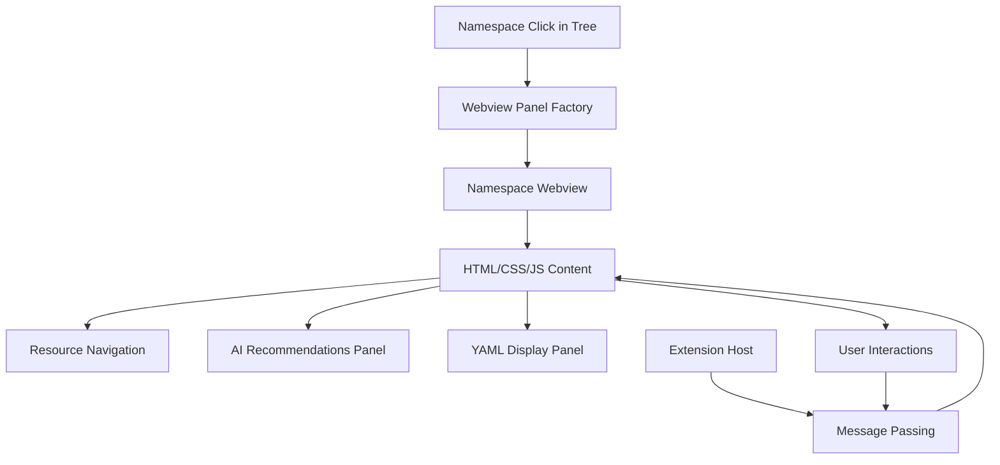
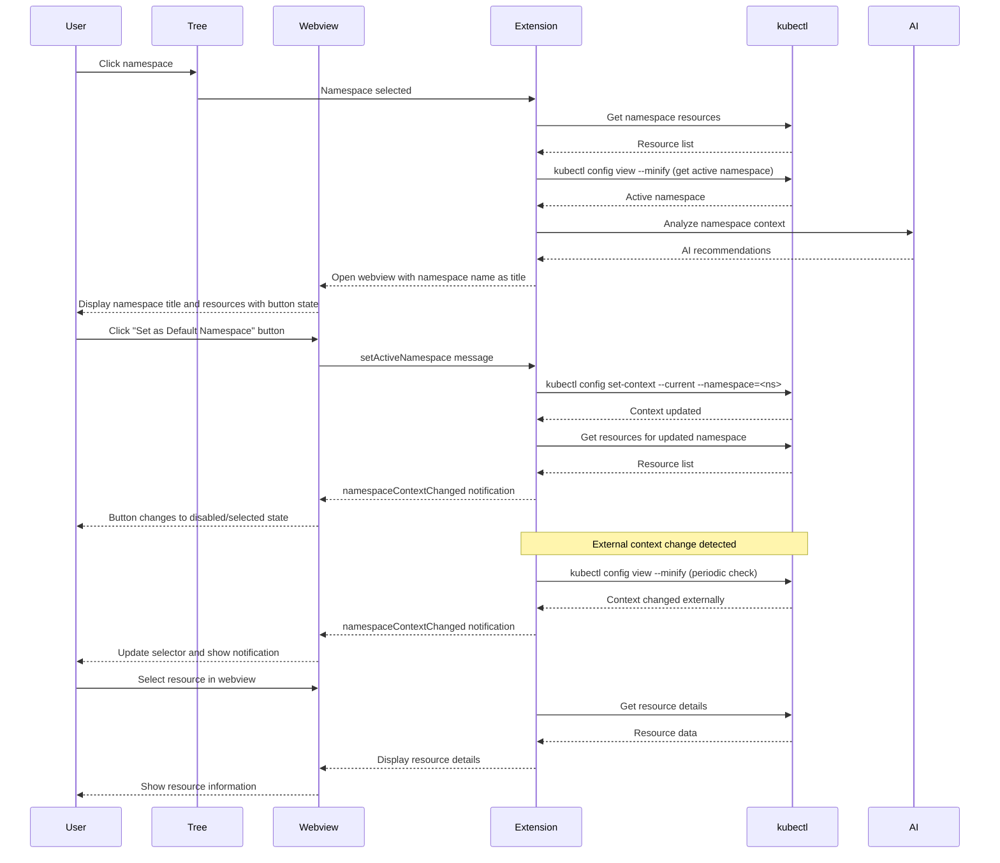

# Webview Panel Specification

## Overview

Webview panels provide detailed views for navigating and managing Kubernetes resources. Webviews are opened when a user clicks on a namespace (or "All Namespaces") in the tree view. The webview provides resource navigation, detailed information, YAML configuration, and AI-powered recommendations.

## Architecture



## Component Responsibilities

### WebviewPanelFactory
- **Purpose**: Creates webview panels for namespace navigation
- **Responsibilities**:
  - Create namespace-specific webview when namespace is clicked in tree
  - Create "All Namespaces" webview for cluster-wide navigation
  - Initialize webview with appropriate HTML/CSS/JS
  - Set up message passing between extension and webview
  - Handle webview lifecycle (create, update, dispose)

### Webview Types
- **Namespace Webview**: Displays resources within a single namespace with navigation, filtering, and AI recommendations
- **All Namespaces Webview**: Displays cluster-wide resource view with ability to browse across all namespaces
- **Resource Detail View**: Within the namespace webview, users can drill down into specific resources (pods, deployments, services, etc.)

## Data Flow



## Implementation Details

### Webview Content Structure
```typescript
interface WebviewContent {
  resource: KubernetesObject;
  metadata: ResourceMetadata;
  status: ResourceStatus;
  aiRecommendations: AIRecommendation[];
  quickActions: QuickAction[];
  yamlContent: string;
  relatedResources: RelatedResource[];
}
```

### Message Protocol
```typescript
// Extension to Webview
interface ExtensionMessage {
  command: 'updateResource' | 'updateRecommendations' | 'showYaml' | 'namespaceContextChanged';
  data: any;
}

// Webview to Extension
interface WebviewMessage {
  command: 'applyRecommendation' | 'editYaml' | 'refreshData' | 'setActiveNamespace';
  data: any;
}

// Namespace context change notification
interface NamespaceContextChangedMessage extends ExtensionMessage {
  command: 'namespaceContextChanged';
  data: {
    namespace: string | null; // null means "All Namespaces"
    source: 'extension' | 'external'; // Where the change came from
    isActive: boolean; // Whether the webview's namespace is now the active one
  };
}
```

## UI Layout Specifications

### Common Layout Structure

**Note**: The namespace name shown in examples (e.g., "production") represents the actual namespace name from Kubernetes.

```html
<div class="webview-container">
  <!-- Header Section with Namespace Title -->
  <div class="namespace-header">
    <h1 class="namespace-title">production</h1>
    <div class="header-actions">
      <button id="set-default-namespace" class="default-namespace-btn" disabled>
        <span class="btn-icon">✓</span>
        <span class="btn-text">Default Namespace</span>
      </button>
      <button id="view-namespace-yaml" class="view-yaml-btn">
        <span class="btn-icon">📄</span>
        <span class="btn-text">View YAML</span>
      </button>
    </div>
  </div>

  <!-- Workloads Section -->
  <div class="workloads-section">
    <h2>Workloads</h2>
    
    <!-- Pill Selectors -->
    <div class="workload-type-pills">
      <button class="pill-selector active" data-workload-type="deployments">
        Deployments
      </button>
      <button class="pill-selector" data-workload-type="statefulsets">
        StatefulSets
      </button>
      <button class="pill-selector" data-workload-type="daemonsets">
        DaemonSets
      </button>
      <button class="pill-selector" data-workload-type="cronjobs">
        CronJobs
      </button>
    </div>
    
    <!-- Workloads Table -->
    <table class="workloads-table">
      <thead>
        <tr>
          <th>Name</th>
          <th>Namespace</th>
          <th>Health</th>
          <th>Ready/Desired</th>
        </tr>
      </thead>
      <tbody>
        <tr class="workload-row">
          <td class="workload-name">nginx-deployment</td>
          <td class="workload-namespace">production</td>
          <td class="workload-health">
            <span class="health-indicator healthy">●</span>
            <span class="health-text">Healthy</span>
          </td>
          <td class="workload-replicas">3/3</td>
        </tr>
        <tr class="workload-row">
          <td class="workload-name">api-deployment</td>
          <td class="workload-namespace">production</td>
          <td class="workload-health">
            <span class="health-indicator degraded">●</span>
            <span class="health-text">Degraded</span>
          </td>
          <td class="workload-replicas">2/3</td>
        </tr>
      </tbody>
    </table>
    <p class="table-note">Workload items are currently non-interactive.</p>
  </div>
</div>
```

### Workloads Section Specification

#### Pill Selector Behavior

The workloads section uses horizontal pill selectors to switch between workload types:

- **Default Selection**: Deployments pill is selected when webview opens
- **Single Selection**: Only one pill can be selected at a time
- **Table Updates**: Clicking a pill updates the table to show only that workload type
- **Visual States**: Active (selected) and inactive (unselected) states with distinct styling
- **Hover Feedback**: Unselected pills show hover effects

#### Data Structure
```typescript
interface WorkloadEntry {
  name: string;
  namespace: string;
  health: WorkloadHealth;
  readyReplicas: number;
  desiredReplicas: number;
}

type WorkloadType = 'Deployment' | 'StatefulSet' | 'DaemonSet' | 'CronJob';

interface WorkloadHealth {
  status: 'Healthy' | 'Degraded' | 'Unhealthy' | 'Unknown';
  podStatus: PodHealthSummary;
}

interface PodHealthSummary {
  totalPods: number;
  readyPods: number;
  healthChecks: {
    passed: number;
    failed: number;
    unknown: number;
  };
}
```

#### Health Calculation Logic
Health status is derived from pod-level health checks and replica status:

1. **Healthy**: All desired replicas are ready AND all pod health checks pass
   - `readyReplicas === desiredReplicas`
   - `healthChecks.failed === 0`

2. **Degraded**: Some replicas are ready OR some health checks failing
   - `readyReplicas < desiredReplicas && readyReplicas > 0`
   - OR `healthChecks.failed > 0 && healthChecks.passed > 0`

3. **Unhealthy**: No replicas ready OR all health checks failing
   - `readyReplicas === 0`
   - OR `healthChecks.passed === 0 && healthChecks.failed > 0`

4. **Unknown**: Unable to determine health status
   - `healthChecks.unknown > 0 && healthChecks.passed === 0 && healthChecks.failed === 0`

#### Workload Types Available
Users can switch between 4 types of workloads using pill selectors:
1. **Deployments**: Standard stateless applications
2. **StatefulSets**: Stateful applications with persistent identity
3. **DaemonSets**: One pod per node workloads
4. **CronJobs**: Scheduled job executions

#### Table Behavior
- **Type Filtering**: Table displays only the workload type selected via pill selector
- **Non-Interactive**: Workload rows are not clickable
- **Visual Feedback**: Rows may have hover styles but no click actions
- **Empty State**: When no workloads of selected type exist, display message: "No {type} found in this namespace"
- **Namespace Filtering**: Table respects active namespace context from kubectl

### Namespace Button Behavior

#### Button State
- **Namespace Title**: Displays the namespace name as the webview title (h1)
- **Button Label**: "Set as Default Namespace" (when enabled) or "Default Namespace" (when disabled)
- **Enabled State**: Button is clickable when viewing a namespace that is NOT the current kubectl context namespace
- **Disabled/Selected State**: Button is disabled with checkmark icon when viewing the namespace that IS the current kubectl context namespace

#### User Interactions
- **Click "Set as Default Namespace" button** (when enabled): 
  - Sends `setActiveNamespace` message to extension with namespace name
  - Extension updates kubectl context
  - Extension sends `namespaceContextChanged` notification back
  - Button changes to disabled/selected state with checkmark
  - Tree view updates to show checkmark on this namespace
  
- **Receive external context change**:
  - Extension sends `namespaceContextChanged` message with isActive flag
  - Webview updates button state based on isActive flag
  - If this namespace is now active externally, button becomes disabled/selected
  - If this namespace is no longer active, button becomes enabled
  - Show notification: "Namespace context changed externally to: <namespace>"

#### CSS Styling
```css
.namespace-header {
  display: flex;
  align-items: center;
  justify-content: space-between;
  padding: 15px;
  background-color: var(--vscode-editor-background);
  border-bottom: 2px solid var(--vscode-panel-border);
}

.namespace-title {
  margin: 0;
  font-size: 1.5em;
  font-weight: 600;
  color: var(--vscode-foreground);
}

.header-actions {
  display: flex;
  align-items: center;
  gap: 10px;
}

.default-namespace-btn {
  display: flex;
  align-items: center;
  gap: 8px;
  padding: 8px 16px;
  background-color: var(--vscode-button-background);
  color: var(--vscode-button-foreground);
  border: none;
  border-radius: 4px;
  cursor: pointer;
  font-size: 0.95em;
}

.default-namespace-btn:hover:not(:disabled) {
  background-color: var(--vscode-button-hoverBackground);
}

.default-namespace-btn:disabled {
  background-color: var(--vscode-button-secondaryBackground);
  color: var(--vscode-button-secondaryForeground);
  cursor: default;
  opacity: 0.8;
}

.default-namespace-btn .btn-icon {
  font-size: 1.1em;
}

.default-namespace-btn:not(:disabled) .btn-icon {
  display: none;
}

.view-yaml-btn {
  display: flex;
  align-items: center;
  gap: 8px;
  padding: 8px 16px;
  background-color: var(--vscode-button-secondaryBackground);
  color: var(--vscode-button-secondaryForeground);
  border: 1px solid var(--vscode-button-border);
  border-radius: 4px;
  cursor: pointer;
  font-size: 0.95em;
}

.view-yaml-btn:hover {
  background-color: var(--vscode-button-secondaryHoverBackground);
  border-color: var(--vscode-focusBorder);
}

.view-yaml-btn .btn-icon {
  font-size: 1.1em;
}

/* Workloads Section Styling */
.workloads-section {
  padding: 20px;
}

.workloads-section h2 {
  margin: 0 0 15px 0;
  font-size: 1.2em;
  font-weight: 600;
  color: var(--vscode-foreground);
}

/* Pill Selector Styling */
.workload-type-pills {
  display: flex;
  gap: 8px;
  margin-bottom: 20px;
  flex-wrap: wrap;
}

.pill-selector {
  padding: 8px 16px;
  border: 1px solid var(--vscode-panel-border);
  background-color: var(--vscode-editor-background);
  color: var(--vscode-descriptionForeground);
  border-radius: 16px;
  cursor: pointer;
  font-size: 0.9em;
  font-weight: 500;
  transition: all 0.2s ease;
}

.pill-selector:hover:not(.active) {
  background-color: var(--vscode-list-hoverBackground);
  border-color: var(--vscode-focusBorder);
}

.pill-selector.active {
  background-color: var(--vscode-button-background);
  color: var(--vscode-button-foreground);
  border-color: var(--vscode-button-background);
  font-weight: 600;
}

.pill-selector:focus {
  outline: 1px solid var(--vscode-focusBorder);
  outline-offset: 2px;
}

/* Workloads Table Styling */

.workloads-table {
  width: 100%;
  border-collapse: collapse;
  background-color: var(--vscode-editor-background);
  border: 1px solid var(--vscode-panel-border);
  border-radius: 4px;
}

.workloads-table thead {
  background-color: var(--vscode-editor-background);
  border-bottom: 2px solid var(--vscode-panel-border);
}

.workloads-table th {
  padding: 12px;
  text-align: left;
  font-weight: 600;
  font-size: 0.9em;
  color: var(--vscode-foreground);
  text-transform: uppercase;
  letter-spacing: 0.5px;
}

.workloads-table td {
  padding: 12px;
  border-bottom: 1px solid var(--vscode-panel-border);
  font-size: 0.95em;
}

.workload-row {
  cursor: default; /* Not clickable until profiles implemented */
}

.workload-row:hover {
  background-color: var(--vscode-list-hoverBackground);
}

.health-indicator {
  font-size: 1.2em;
  margin-right: 6px;
}

.health-indicator.healthy {
  color: var(--vscode-testing-iconPassed);
}

.health-indicator.degraded {
  color: var(--vscode-editorWarning-foreground);
}

.health-indicator.unhealthy {
  color: var(--vscode-testing-iconFailed);
}

.health-indicator.unknown {
  color: var(--vscode-descriptionForeground);
}

.workload-health {
  display: flex;
  align-items: center;
}

.table-note {
  margin-top: 10px;
  font-size: 0.85em;
  color: var(--vscode-descriptionForeground);
  font-style: italic;
}
```

### Responsive Design
- **Mobile-friendly**: Support for different screen sizes
- **VS Code Integration**: Match VS Code's design language
- **Accessibility**: Proper ARIA labels and keyboard navigation
- **Performance**: Lazy loading of tab content

## AI Integration

### Recommendation Display
```typescript
interface AIRecommendation {
  id: string;
  type: 'optimization' | 'security' | 'performance' | 'best-practice';
  title: string;
  description: string;
  priority: 'low' | 'medium' | 'high';
  action: {
    label: string;
    type: 'yaml-change' | 'kubectl-command' | 'configuration';
    data: any;
  };
  reasoning: string;
  confidence: number;
}
```

### Contextual Recommendations
- **Based on Resource Type**: Different recommendations for pods vs deployments
- **Based on Cluster State**: Consider current resource usage and capacity
- **Based on Configuration**: Analyze YAML against best practices
- **Based on History**: Consider past issues and patterns

## Performance Considerations

### Efficient Rendering
- **Virtual Scrolling**: For large YAML content and log displays
- **Incremental Updates**: Update only changed sections
- **Lazy Loading**: Load detailed data only when needed
- **Caching**: Cache webview content and AI recommendations

### Memory Management
- **Webview Disposal**: Clean up webviews when no longer needed
- **Data Cleanup**: Remove sensitive data after use
- **Connection Management**: Proper cleanup of API connections

## User Experience

### Visual Design
- **Consistent Styling**: Match VS Code's design system
- **Clear Information Hierarchy**: Important info prominent, details accessible
- **Interactive Elements**: Hover effects, click handlers, tooltips
- **Status Indicators**: Clear visual feedback for all states

### Accessibility
- **Keyboard Navigation**: Full keyboard support
- **Screen Reader Support**: Proper ARIA labels and descriptions
- **High Contrast**: Support for accessibility modes
- **Font Scaling**: Responsive to user preferences

## Testing Strategy

### Unit Tests
- Webview panel creation and lifecycle
- Message passing between extension and webview
- UI component rendering and interactions

### Integration Tests
- Resource data loading and display
- AI recommendation integration
- YAML editing and validation
- Namespace button state based on kubectl context
- kubectl context updates from webview button clicks
- Message passing between webview and extension for namespace changes
- Button state transitions (enabled ↔ disabled/selected)

### E2E Tests
- Complete workflows from tree selection to webview interaction
- AI recommendation application and validation
- Cross-resource navigation and context switching
- Clicking namespace in tree opens webview with namespace name as title
- Button enabled state when viewing non-active namespace
- Button disabled/selected state when viewing active namespace
- Clicking enabled button sets namespace as active and updates button state
- External namespace context change detection and webview button update
- Button state synchronization across multiple webviews for same namespace
- Workloads section displays pill selectors for 4 workload types
- Deployments pill is selected by default
- Clicking pill updates table to show only selected workload type
- Only one pill can be selected at a time
- Health status correctly calculated from pod health checks
- Ready/Desired replica counts display correctly
- Workload items are non-interactive
- Empty state message specific to selected workload type
- Table respects active namespace filtering

## Security Considerations

### Data Sanitization
- Remove sensitive data before displaying in webview
- Validate all user inputs and AI recommendations
- Implement proper escaping for HTML content

### Access Control
- Respect Kubernetes RBAC permissions
- Show appropriate error messages for access denied
- Don't expose cluster credentials in webview

## Future Enhancements

### Advanced Features
- **Real-time Updates**: Live data streaming to webview
- **Interactive Editing**: Edit resources directly in webview
- **Multi-resource Views**: Compare multiple resources
- **Custom Dashboards**: User-configurable views
