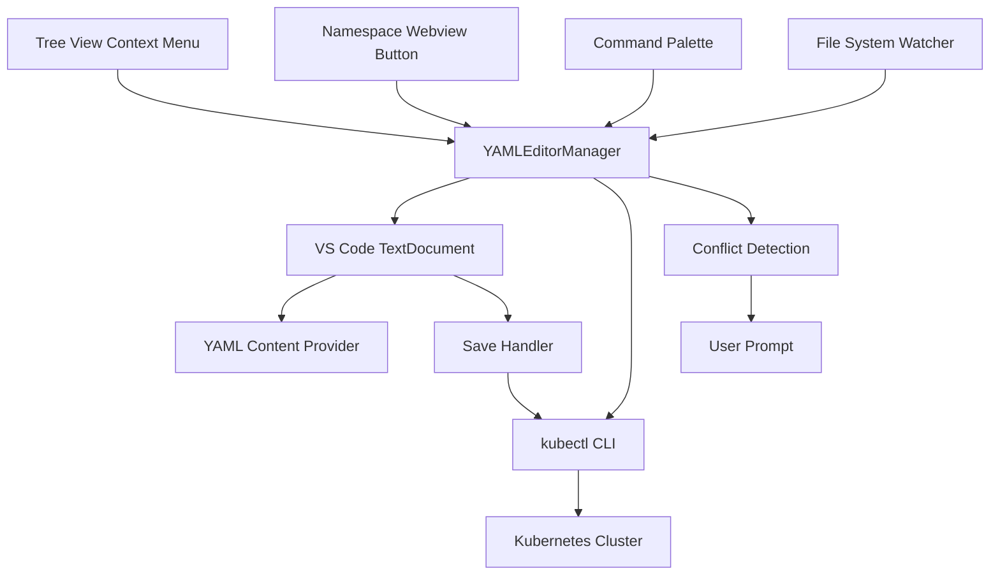
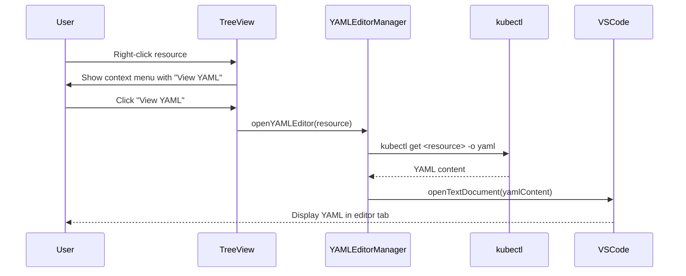
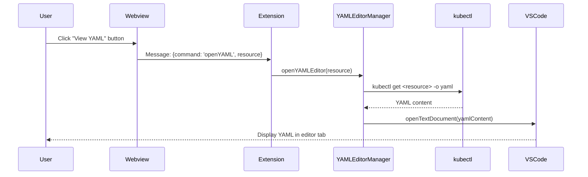
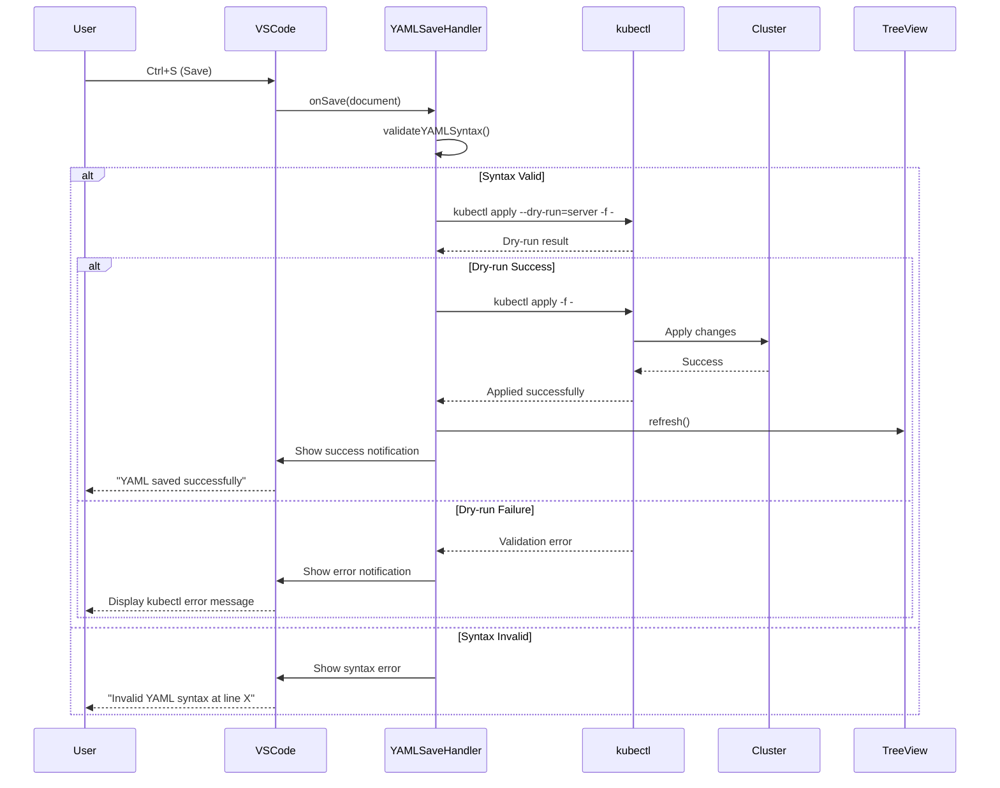
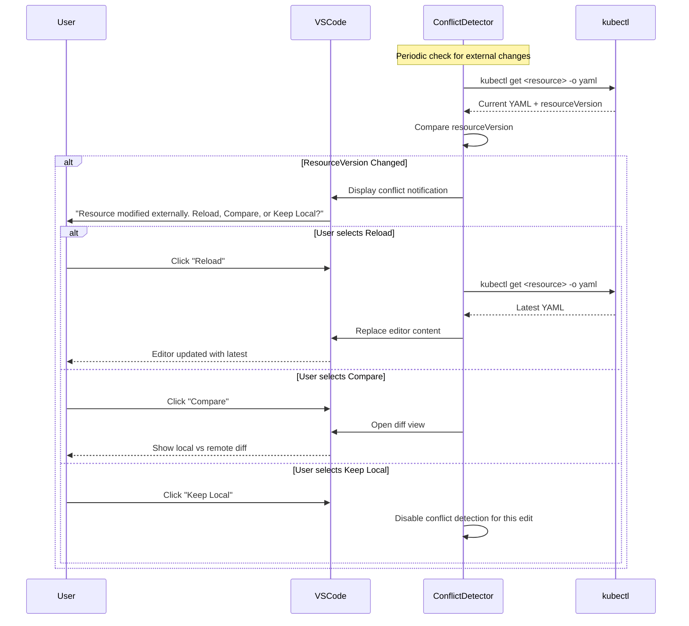

# YAML Editor Specification

## Overview

The YAML editor provides users with the ability to view, edit, and save Kubernetes resource YAML configurations directly within VS Code. It integrates with both the tree view (via context menu) and namespace webview (via action buttons) to provide a consistent editing experience similar to the standard Kubernetes extension.

## Architecture

### Component Structure



## Component Responsibilities

### YAMLEditorManager
- **Purpose**: Central manager for YAML editor operations
- **Responsibilities**:
  - Create and manage YAML editor instances
  - Handle resource fetching via kubectl
  - Coordinate save operations
  - Manage editor lifecycle
  - Track open editors and their associated resources
  - Detect and resolve conflicts

### YAMLContentProvider
- **Purpose**: Provide YAML content to VS Code text documents
- **Responsibilities**:
  - Fetch resource YAML from cluster using `kubectl get <resource> -o yaml`
  - Format YAML with proper syntax highlighting
  - Provide initial content for new editor instances
  - Handle resource-not-found scenarios

### YAMLSaveHandler
- **Purpose**: Handle save operations for YAML editors
- **Responsibilities**:
  - Validate YAML syntax before save
  - Execute dry-run validation using `kubectl apply --dry-run=server`
  - Apply changes to cluster using `kubectl apply`
  - Handle permission errors and kubectl failures
  - Trigger refresh of tree view and webviews after successful save
  - Display success/error notifications

### ConflictDetector
- **Purpose**: Detect external changes to resources being edited
- **Responsibilities**:
  - Monitor resourceVersion changes
  - Compare local edits with cluster state
  - Prompt user when conflicts are detected
  - Provide conflict resolution options (Reload, Compare, Keep Local)

## Data Flow

### Opening YAML Editor from Tree View



### Opening YAML Editor from Webview



### Saving YAML Changes



### Conflict Detection and Resolution



## Implementation Details

### Resource Identification

Each YAML editor needs to track the resource being edited:

```typescript
interface ResourceIdentifier {
  kind: string;              // e.g., "Deployment", "StatefulSet", "Pod"
  name: string;              // Resource name
  namespace?: string;        // Namespace (undefined for cluster-scoped resources)
  apiVersion: string;        // e.g., "apps/v1"
  resourceVersion: string;   // For conflict detection
  cluster: string;           // Cluster context name
}
```

### kubectl Command Construction

#### Fetching YAML
```bash
# Namespaced resource
kubectl get <kind> <name> -n <namespace> -o yaml

# Cluster-scoped resource
kubectl get <kind> <name> -o yaml

# Examples
kubectl get deployment nginx-deployment -n production -o yaml
kubectl get node worker-node-1 -o yaml
```

#### Dry-run Validation
```bash
# Using stdin for YAML content
kubectl apply --dry-run=server -f -

# The YAML content is piped to stdin
echo "$YAML_CONTENT" | kubectl apply --dry-run=server -f -
```

#### Applying Changes
```bash
# Using stdin for YAML content
kubectl apply -f -

# The YAML content is piped to stdin
echo "$YAML_CONTENT" | kubectl apply -f -
```

### VS Code Integration

#### Text Document Management

```typescript
// Create custom URI scheme for YAML editors
const uri = vscode.Uri.parse(`kube9-yaml://${cluster}/${namespace}/${kind}/${name}.yaml`);

// Open as text document with YAML language mode
const document = await vscode.workspace.openTextDocument({
  language: 'yaml',
  content: yamlContent
});

// Show in editor
await vscode.window.showTextDocument(document, {
  preview: false,  // Open in permanent tab
  preserveFocus: false
});
```

#### Save Handler Registration

```typescript
// Register save event handler
vscode.workspace.onWillSaveTextDocument(async (event) => {
  const document = event.document;
  
  // Check if this is a kube9 YAML editor
  if (document.uri.scheme === 'kube9-yaml') {
    event.waitUntil(
      yamlSaveHandler.handleSave(document)
    );
  }
});
```

#### File System Provider for Custom Scheme

```typescript
class Kube9YAMLFileSystemProvider implements vscode.FileSystemProvider {
  // Implement required methods for custom URI scheme
  
  async readFile(uri: vscode.Uri): Promise<Uint8Array> {
    const resource = parseResourceFromUri(uri);
    const yamlContent = await fetchResourceYAML(resource);
    return Buffer.from(yamlContent, 'utf-8');
  }
  
  async writeFile(uri: vscode.Uri, content: Uint8Array): Promise<void> {
    const resource = parseResourceFromUri(uri);
    const yamlContent = Buffer.from(content).toString('utf-8');
    await applyResourceYAML(resource, yamlContent);
  }
  
  // ... other required methods
}

// Register the file system provider
context.subscriptions.push(
  vscode.workspace.registerFileSystemProvider('kube9-yaml', new Kube9YAMLFileSystemProvider())
);
```

### Context Menu Integration

#### package.json Configuration

```json
{
  "contributes": {
    "menus": {
      "view/item/context": [
        {
          "command": "kube9.viewResourceYAML",
          "when": "view == kube9TreeView && viewItem =~ /^resource/",
          "group": "kube9@1"
        }
      ]
    },
    "commands": [
      {
        "command": "kube9.viewResourceYAML",
        "title": "View YAML",
        "category": "Kube9"
      }
    ]
  }
}
```

#### Tree Item Context Value

```typescript
// When creating tree items for resources, set contextValue
class ResourceTreeItem extends vscode.TreeItem {
  contextValue = 'resource:deployment';  // Pattern: resource:<kind>
  
  constructor(
    public readonly resource: KubernetesResource
  ) {
    super(resource.name, vscode.TreeItemCollapsibleState.None);
  }
}
```

### Webview Button Integration

#### HTML Button in Namespace Header

```html
<div class="namespace-header">
  <h1 class="namespace-title">production</h1>
  <div class="header-actions">
    <button id="set-default-namespace" class="default-namespace-btn">
      <span class="btn-text">Set as Default Namespace</span>
    </button>
    <button id="view-namespace-yaml" class="view-yaml-btn" data-namespace="production">
      <span class="btn-icon">📄</span>
      <span class="btn-text">View YAML</span>
    </button>
  </div>
</div>
```

#### Webview Message Handling

```typescript
// In webview HTML/JavaScript
document.querySelector('#view-namespace-yaml').addEventListener('click', (event) => {
  const button = event.currentTarget;
  const namespaceName = button.dataset.namespace;
  
  // Send message to extension
  vscode.postMessage({
    command: 'openYAML',
    resource: {
      kind: 'Namespace',
      name: namespaceName,
      apiVersion: 'v1'
    }
  });
});

// In extension message handler
webviewPanel.webview.onDidReceiveMessage(async (message) => {
  if (message.command === 'openYAML') {
    await yamlEditorManager.openYAMLEditor(message.resource);
  }
});
```

### YAML Validation

#### Syntax Validation

```typescript
import * as yaml from 'js-yaml';

function validateYAMLSyntax(content: string): { valid: boolean; error?: string; line?: number } {
  try {
    yaml.load(content);
    return { valid: true };
  } catch (error) {
    if (error instanceof yaml.YAMLException) {
      return {
        valid: false,
        error: error.message,
        line: error.mark?.line
      };
    }
    return {
      valid: false,
      error: 'Unknown YAML parsing error'
    };
  }
}
```

#### Kubernetes Schema Validation (Dry-run)

```typescript
async function validateKubernetesResource(yamlContent: string): Promise<ValidationResult> {
  try {
    // Execute dry-run
    const result = await execKubectl(['apply', '--dry-run=server', '-f', '-'], yamlContent);
    
    if (result.exitCode === 0) {
      return { valid: true };
    } else {
      return {
        valid: false,
        error: result.stderr,
        type: 'kubernetes'
      };
    }
  } catch (error) {
    return {
      valid: false,
      error: error.message,
      type: 'execution'
    };
  }
}
```

### Permission Handling

```typescript
async function checkResourcePermissions(resource: ResourceIdentifier): Promise<PermissionLevel> {
  try {
    // Check if user can update this resource
    const checkUpdate = await execKubectl([
      'auth', 'can-i', 'update',
      resource.kind.toLowerCase(),
      resource.name,
      '-n', resource.namespace || ''
    ]);
    
    if (checkUpdate.stdout.trim() === 'yes') {
      return PermissionLevel.ReadWrite;
    }
    
    // Check if user can at least read
    const checkGet = await execKubectl([
      'auth', 'can-i', 'get',
      resource.kind.toLowerCase(),
      resource.name,
      '-n', resource.namespace || ''
    ]);
    
    if (checkGet.stdout.trim() === 'yes') {
      return PermissionLevel.ReadOnly;
    }
    
    return PermissionLevel.None;
  } catch (error) {
    return PermissionLevel.Unknown;
  }
}

enum PermissionLevel {
  None,
  ReadOnly,
  ReadWrite,
  Unknown
}
```

### Conflict Detection

```typescript
interface ResourceState {
  resourceVersion: string;
  lastChecked: Date;
  content: string;
}

class ConflictDetector {
  private resourceStates = new Map<string, ResourceState>();
  
  async checkForConflicts(resource: ResourceIdentifier, currentContent: string): Promise<ConflictStatus> {
    const resourceKey = this.getResourceKey(resource);
    const cachedState = this.resourceStates.get(resourceKey);
    
    if (!cachedState) {
      // First time checking, store initial state
      this.resourceStates.set(resourceKey, {
        resourceVersion: resource.resourceVersion,
        lastChecked: new Date(),
        content: currentContent
      });
      return { hasConflict: false };
    }
    
    // Fetch current state from cluster
    const clusterYAML = await this.fetchResourceYAML(resource);
    const clusterVersion = this.extractResourceVersion(clusterYAML);
    
    if (clusterVersion !== cachedState.resourceVersion) {
      // Resource has been modified externally
      return {
        hasConflict: true,
        localContent: currentContent,
        remoteContent: clusterYAML,
        remoteVersion: clusterVersion
      };
    }
    
    return { hasConflict: false };
  }
  
  private extractResourceVersion(yamlContent: string): string {
    const parsed = yaml.load(yamlContent);
    return parsed?.metadata?.resourceVersion || '';
  }
  
  private getResourceKey(resource: ResourceIdentifier): string {
    return `${resource.cluster}:${resource.namespace || '_cluster'}:${resource.kind}:${resource.name}`;
  }
}
```

### Refresh Coordination

After a successful YAML save, multiple components need to refresh:

```typescript
class RefreshCoordinator {
  async coordinateRefresh(resource: ResourceIdentifier): Promise<void> {
    // Refresh tree view
    await this.refreshTreeView(resource);
    
    // Refresh any open namespace webviews
    await this.refreshNamespaceWebviews(resource.namespace);
    
    // Notify user
    vscode.window.showInformationMessage(
      `${resource.kind} '${resource.name}' updated successfully`
    );
  }
  
  private async refreshTreeView(resource: ResourceIdentifier): Promise<void> {
    // Trigger tree view refresh
    vscode.commands.executeCommand('kube9.refreshTreeView');
  }
  
  private async refreshNamespaceWebviews(namespace?: string): Promise<void> {
    // Find all open webviews for this namespace
    const webviews = this.webviewManager.getWebviewsForNamespace(namespace);
    
    // Send refresh message to each
    for (const webview of webviews) {
      webview.webview.postMessage({
        command: 'resourceUpdated',
        namespace: namespace
      });
    }
  }
}
```

## Error Handling

### kubectl Execution Errors

```typescript
interface KubectlError {
  exitCode: number;
  stderr: string;
  message: string;
}

function handleKubectlError(error: KubectlError): void {
  // Parse common error types
  if (error.stderr.includes('connection refused')) {
    vscode.window.showErrorMessage(
      'Failed to connect to cluster. Please check your connection and try again.'
    );
  } else if (error.stderr.includes('Unauthorized') || error.stderr.includes('Forbidden')) {
    vscode.window.showErrorMessage(
      'Insufficient permissions to perform this operation.'
    );
  } else if (error.stderr.includes('NotFound')) {
    vscode.window.showErrorMessage(
      'Resource not found. It may have been deleted.'
    );
  } else {
    // Show full kubectl error
    vscode.window.showErrorMessage(
      `kubectl error: ${error.stderr}`,
      'View Details'
    ).then(selection => {
      if (selection === 'View Details') {
        // Show detailed error in output panel
        outputChannel.appendLine('kubectl error:');
        outputChannel.appendLine(error.stderr);
        outputChannel.show();
      }
    });
  }
}
```

### YAML Syntax Errors

```typescript
function handleYAMLSyntaxError(error: yaml.YAMLException, document: vscode.TextDocument): void {
  const line = error.mark?.line || 0;
  const column = error.mark?.column || 0;
  
  // Show error message
  vscode.window.showErrorMessage(
    `YAML syntax error at line ${line + 1}: ${error.message}`
  );
  
  // Highlight error line in editor
  const editor = vscode.window.activeTextEditor;
  if (editor && editor.document === document) {
    const range = new vscode.Range(
      new vscode.Position(line, 0),
      new vscode.Position(line, Number.MAX_VALUE)
    );
    
    editor.selection = new vscode.Selection(range.start, range.end);
    editor.revealRange(range, vscode.TextEditorRevealType.InCenter);
  }
}
```

### Network and Connectivity Errors

```typescript
async function handleConnectivityError(resource: ResourceIdentifier): Promise<void> {
  const retry = await vscode.window.showErrorMessage(
    `Unable to connect to cluster '${resource.cluster}'. Would you like to retry?`,
    'Retry',
    'Cancel'
  );
  
  if (retry === 'Retry') {
    // Retry the operation
    return yamlEditorManager.openYAMLEditor(resource);
  }
}
```

## Performance Considerations

### Editor Lifecycle Management

- Limit the number of simultaneously open YAML editors
- Clean up editor state when editors are closed
- Reuse existing editor if same resource is opened again
- Dispose of watchers and subscriptions properly

### Conflict Detection Optimization

- Don't check for conflicts on every keystroke
- Use debouncing with 30-second intervals
- Only check when editor has focus
- Cache resourceVersions to minimize kubectl calls

### kubectl Process Management

- Reuse kubectl processes when possible
- Set timeouts for long-running operations
- Implement proper process cleanup on extension deactivation
- Use connection pooling for cluster communication

## Testing Strategy

### Unit Tests

- YAML syntax validation logic
- ResourceIdentifier parsing and formatting
- kubectl command construction
- Permission level detection
- Conflict detection logic
- Error handling for various kubectl failures

### Integration Tests

- Opening YAML editor from tree view context menu
- Opening YAML editor from webview button
- Saving valid YAML changes to cluster
- Dry-run validation before save
- Read-only mode for insufficient permissions
- Conflict detection and resolution
- Multiple editors open simultaneously

### E2E Tests

- Complete workflow: Open → Edit → Save → Verify in cluster
- Context menu appears on appropriate tree items
- Webview button triggers YAML editor
- Syntax errors prevent save
- Kubernetes validation errors display correctly
- External changes trigger conflict notification
- Read-only mode prevents editing
- Refresh coordination after successful save
- Editor tab naming follows convention

## Security Considerations

### Sensitive Data Handling

- Never log full YAML content (may contain secrets)
- Warn users before editing Secret resources
- Sanitize error messages to avoid exposing sensitive data
- Don't cache YAML content longer than necessary

### Cluster Access

- Respect RBAC permissions from Kubernetes
- Use kubectl's built-in authentication
- Don't bypass cluster security policies
- Validate user permissions before allowing edits

## Future Enhancements

### Advanced Features
- **YAML Diff View**: Show diff between local and cluster state
- **Multi-resource Edit**: Edit multiple resources in split view
- **YAML Snippets**: Provide common YAML patterns and templates
- **Auto-completion**: Kubernetes schema-aware YAML completion
- **Helm Chart Support**: Edit Helm values.yaml files
- **History View**: Show revision history for resources

